# 顺序程序设计

（*This Readme is generated by **Writage** automatically*)

1.  实验内容、目的与要求

题目一要求我们利用串操作指令将0FFH送入数据段的0180H开始的128个字节存储单元中。

>   通过本实验，要熟悉DEBUG程序的使用过程。包括利用DEBUG程序的A命令，进行编辑和汇编；利用U命令反汇编，查看编辑程序是否正确，也可借此得知各条指令的IP值；利用T、G命令对程序但不，设断点，连续执行；利用R、D、E命令对程序运行前预置数据，运行中检查数据，检查最终结果；利用Q命令退出DEBUG程序，返回MSDOS。

1.  实验硬件与软件环境（标注实验设备名称、设备号）

>   硬件环境：微型计算机

>   软件环境：Windows XP操作系统 调试DEBUG, COM, M2015集成工具

1.  实验原理与步骤

>   首先对程序进行设计，题目一要求在DS数据段中连续写入一段数据，这要用到串操作指令中的串装入指令——`STOS`以及`STOSB`(按字节装入)和`STOSW`（按字装入），事实上，这个指令常用来将内存某个区域置同样的值

>   这条指令的基本格式为
>
>   ```
>   STOS OPRD
>   ```
>
>   但在大多数情况下，我们不经常直接用`STOS`指令，而是`STOSB`和`STOSW`，这两条指令都不跟操作数，说明操作数是预先隐式的给出了的。

>   STOSB的原数据存储于AL中（一个字节长度），目标串的起始偏移地址为DI，且其默认段基地址是ES即附加段。串长度由CX给定，DF确定串存储的操作方向：当DF=0时，为增地址方向；当DF=1时，为减地址方向。

>   `STOSW`与`STOSB`的不同在于前者是一次传递一个字（`WORD`,
>   两个字节），原数据要存放在`AX`中。由于我们的数据为`0FFH`是一个字节长，因而选择使用STOSB指令，同时还要注意在其前面加上无条件循环REP指令

>   综上，我们设计出本程序的（核心）汇编代码如下（对代码段的定义这样的伪指令不再写出）：

>   ```
>      MOV DI, 0180H
>   
>      MOV CX, 80H
>   
>      MOV AL, 0FFH
>   
>      REP STOSB
>   
>      HLT
>   ```
>
>   

>   四、实验数据记录及实验结果

>   本实验一方面锻炼了我们设计程序的基本操作，同时掌握了基本的汇编代码编译执行流程与DEBUG的使用。

>   我们首先要对写好的代码编译链接，将其存为文件*ASMEXP1.asm*

>   然后进行汇编

>   ```
>   D:\>MASM ASMEXP1.asm
>   ```

>   再运行链接程序

>   ```
>   D:\>LINK ASMEXP1.obj
>   ```

>   过程无报错，我们发现有ASMEXP1.exe文件生成，整体编译成功。然后，运行DEBUG程序，即

>   ```
>   D:\>DEBUG ASMEXP1.exe
>   ```

>   上述步骤也可以直接运行DEBUG程序后用A命令编辑得到。

>   下面我们首先使用DEBUG的U命令，这是反汇编指令，通过它可以查看位于CS的指令的反汇编后结果，格式为
>
>   ```
>   _U  [range]
>   ```

>   其中range表明指定要反汇编的起始地址和结束地址，或起始地址与长度，例如，我们想要从地址
>   `CS:0000`开始反汇编`16（10H）`的字节，应该用
>
>   ```
>   _U CS:000010
>   ```
>
>   。参数range在省略的情形下默认分解20H字节内容。下面是我们的反汇编结果

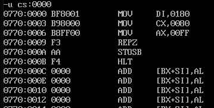

>   可以看到汇编代码已经被“翻译”成了机器码，同时我们还可以注意到终止代码的`IP`为`CS:000B(CS=0770)`，记住这一点是十分实用的，可以方便我们之后之间跳转到程序的末尾处

>   此时程序还为执行，我们使用R命令查看通用寄存器状态。R命令就是用于显示或改变一个或多个寄存器的内容，格式为
>
>   ```
>   _R
>   [register_name]
>   ```

>   当无参数传入时，R命令显示所有寄存器和寄存器存储区域中的标志（FLAGS）；如果制定了寄存器名称register_name，则DEBUG程序将显示以16进制显示该寄存器中的值，并将冒号（：）作为提示符。如果要更改这个值，在冒号后键入新值并回车即可，否则直接回车不会对这个寄存器中的值产生影响。

>   因此，我们需要查看当前寄存器值，使用R命令（不含参数）即可，结果为

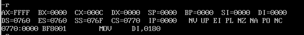

>   这是程序执行前的情况，我们做一下记录：

>   ```
>   AL = 0FF, DI = 0000, CX=000C, DS=0760, CS=0770, IP=0000(均以二进制表示)
>   ```

>   同时，我们再用D命令查看一下相关存储区间状态，D命令是用来显示一定范围内容的命令，其格式为
>
>   ```
>   _D [range]
>   ```

>   当我们给出range值时，DEBUG程序将显示其指出的起始地址与结束地址间存储的内容；如果range并未给出，程序将根据以往D命令中所指定的地址范围的末尾开始显示128个字节的内容。

>   在这里，我们希望查看`ES:0180`起始的存储内容，之所以是这一段，前面在介绍程序功能时已经提及——数据0FFH将被写入`ES`段，起始地址为`0180H`。因此这里执行的命令是

>   ```
>   _D ES:0180
>   ```
>
>   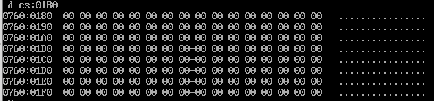

>   很显然，在程序未执行前，这一部分并没有数据写入，且都是空的状态。

>   下面我们将要执行编写的程序，需要单步执行，使用T命令即可

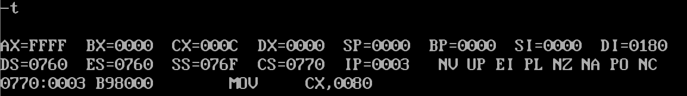

>   每执行一次T命令，程序单步运行一次，同时返回通用寄存器的当前状态，我们再进行记录：

>   ```
>   AL = 0FF, DI = 0180, CX=000C, DS=0760, CS=0770, IP=0003
>   ```

>   由于这一步对应于

>   ```
>   MOV DI, 0180H
>   ```

>   所以可以观察到DI寄存器的值由`0000`变成了`0180`，且注意到`IP`由`0000`变成`0003`，这是第一步程序已执行完毕，指令指针随之后移。

>   再单步执行一次，得到

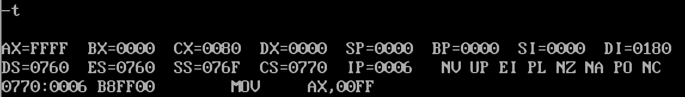

>   记录为：

>   ```
>   AL = 0FF, DI = 0180, CX=0080, DS=0760, CS=0770, IP=0006
>   ```

>   可以看到`CX`由`0000`变为`0080`，这是因为接下来执行的是

>   ```
>   MOV CX, 80H
>   ```

>   继续单步执行三次，如下图所示

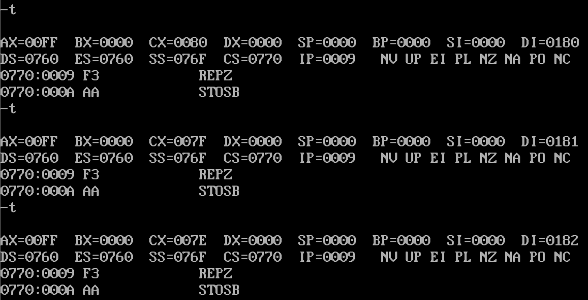

>   可以注意到这里IP似乎被“固定”住了，实际上是因为已经进入了循环，我们观察各次的不同，发现在循环过程中CX逐次减1，DI逐次加1，其余值不变。这正是因为在循环过程中，目标地址偏移量DI递增，而计数值CX递减。这个循环就是我们编写的：

>   ```
>   REP STOSB
>   ```

>   继续执行下去，直到执行到最后一条命令为止，如果我们始终使用T命令，则有些麻烦，可以使用G命令，它的使用格式为
>
>   ```
>   _G [=address]
>   ```
>
>
>   [breakpoints]参数address制定了要跳转运行到的程序地址，breakpoints指定可以设置为G命令的1到10个临时断点。

>   前面已经通过反汇编查看了终止命令HLT所在的地址(即IP)为`000B`。因而，执行
>
>   ```
>   _G 000B
>   ```
>
>   可以一步到位地执行完我们编写的所有代码。

>   用D命令查看最终结果（`ES:0180`）

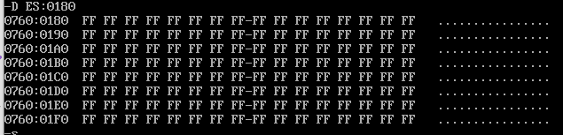

>   达成了设计的功能，`ES:0180`起已经被写入了128个字节的0FFH数据

>   然后，我们再次使用R命令，只不过这次不是简单的查看各寄存器状态，而是修改当前的`IP`值到`0000`（程序起始位置）

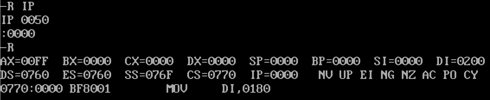

>   可以看到当前`IP`为`0000`，再次指向程序的起始位置

>   再使用A命令对存储数据的缓冲区改变位置，将第一行的`MOV DI, 0180H`改为`MOV DI,
>   0200H`，这是因为经过刚才的数据写入，`S:0180H`到`ES:0180H+0080H`也即`ES:0200H`的数据都已经被填充了，如果希望接着刚才的位置再完成一次128字节的数据写入，应当把起始地址偏移量改为`0200H`这需要存放在寄存器`DI`中，所以我们要对程序的首段做这样的修改。

>   执行A命令完成修改如下

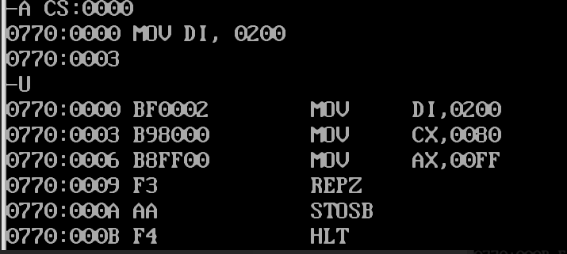

>   在执行程序前，先查看一下附加段存储区ES:0200的内容，用D命令

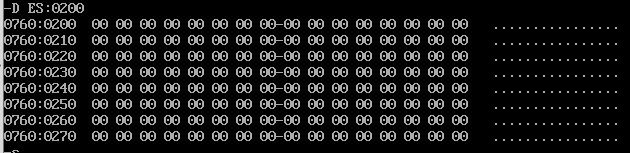

>   用G命令执行程序，从当前IP语句直到HLT指令处，为

>   ```
>   _G 000B
>   ```

>   下面是整体的执行结果显示，可以看到，`ES:0200H——ES:027FH`的内容全变为`FF`

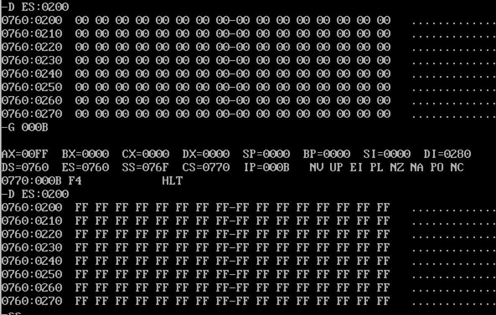


