### 实验名称  分支程序设计

## 实验内容、目的与要求

#### *实验内容：*


用地址表法完成多路分支程序设计，根据MODE单元中的模式字（0\~7）分别转向L0, L1, …, L7标号处执行。L0, L1, …, L7程序段中分别实现显式执行’0’ \~ ‘7’字符。（可用DOS系统INT 21H中断）

也即是当`MODE = 0`时，转`L0`，显示’0’;

当`MODE = 1`时，转`L1`，显示’1’;

…

当`MODE = 7`时，转`L7`，显示’7’;

实验目的：熟悉编辑，汇编，链接和调试程序在DOS系统状态下的书写格式。熟悉编辑和调试程序中的常用命令的使用方法。熟悉分支结构的基本结构，以及用地址表法实现的原理。

#### *实验要求：*

1.  所编写的程序要用段语句定义子段：数据段，堆栈段和代码段，用变量和符号来定于一地址，用符号来定义常量，原始数据用初始化变量来存储以及保留空单元，分段结构应符合ASM_86汇编规定

2.  用文本编辑器对所编写的源程序进行编辑，形成ASM文件存于磁盘上。熟练掌握编辑程序中的常用命令，用插入、替代、删除来编辑和修改源程序，用退出和存盘来结束编辑。

3.  用汇编程序对.ASM源程序进行汇编，能够看懂报错信息，并可以重新对程序进行修改，直到汇编结束后无错误为止

4.  用链接程序对一个或多个OBJ文件进行链接，形成EXE可执行文件

5.  用调试程序对.EXE文件进行调试和运行。用U命令了解程序起始地址，标号和偏移地址；用R命令知悉CPU中各寄存器及标志的原始值；用T和G命令执行程序；用R和D命令验证程序执行过程中的中间结果和最终结果。

6.  实验硬件与软件环境（标注实验设备名称、设备号）

硬件环境：微型计算机

软件环境：Windows XP操作系统 调试DEBUG, COM, M2015集成工具

## 实验原理与步骤

按照程序题目要求的内容，我们可以画出它的流程框图，作图如下

首先我们要进行一个简单的判断，确认从`MODE`中读取的模式字是在0\~7范围内，这需要用到比较指令`CMP`和条件跳转指令`JA,` `JB`

 `CMP`的使用格式为

```assembly
CMP OPRD1, OPRD2
```

将会执行操作`OPRD1-OPRD2`，不过，这将并不会送入目标操作数，而仅影响标志位。对于两个无符号数，通过标志位CF和ZF进行判别：若AX$$\geq$$BX，则CF=0；若AX\<BX，则CF=1;若AX=BX，则CF=1且ZF=1。而对于两个带符号数的计算，应由OF与SF的状态共同决定：当OF与SF状态一致，判定AX$$\geq$$BX；当OF与SF状态不同，判定AX\<BX。在这里，模式字视为无符号数即可。

在实际的代码中，我们不必显式地体现我们的比较过程，而可以直接使用条件跳转指令JA和JB，JA表示高于（不低于）转移，JB表示低于（不高于）转移。跳转指令后面都跟要跳转的代码段标记。按照设计，如果模式字不在0\~7范围内，我们直接使其跳转到程序的结尾处使其结束。

下面要考虑的就是利用地址表完成分支结构，地址表已经预先在数据段DS设计好了，即

```assembly
A DW L0, L1, L2, L3, L4, L5, L6, L7
```

`L0, …, L7`对应于代码段要执行的标记位，以`L0`为例，我们要在屏幕上显示字符’0’，同样事先已经在数据段定义常量S0为’0’（代码为`S0`
`DB ‘0’`）,只需将送入`DX`即可——这么做的原因是我们最终要完成单字符显示的系统功能调用，在这里是通过将功能号2置入AH，且将待显示字符置入`DL`，并完成INT
21H中断实现的。因此L0代码段的具体代码为：

```assembly
L0: LEA DX, S0

JMP END
```

其中`LEA DX, S0`就相当于`MOV DX, OFFSET S0`即将S0的偏移地址送入DX中。

所以，`L0\~L7`的代码段我们就清晰了，那么，如何由模式字进入特定的分支呢？

首先我们已经将模式字送入AL中，为了让AX与模式字完全一致，应当使得其高位置零，可以通过逻辑与指令AND实现，具体代码为：

```assembly
AND AX, 000FH
```

这时，AX中的模式字还并不能与地址表A中`L0, L1, …, L7`各段一一对应起来，因为我们声明的地址表A中每个元素占一个字（`WORD`）长（因为使用的数据定义伪指令是`DW`），所以要对AX做乘二处理，这样才能够与其偏移地址一一对应起来。

事实上，这里的“乘二”处理不必一定需要使用乘法指令`MUL`或`IMUL`，因为“乘二”的结果其实是对操作数左移一位，因而利用移位指令即可。具体分析，这里我们把AX中的数视为无符号数，同时不需要循环移位处理，所以选择的移位指令是`SHL, SHL`的使用格式为

```assembly
SHL OPRD, CL
```

这将对目标操作数完成逻辑移位，移位的位数为`CL`，因而题目的代码写为：

```assembly
SHL AX, 1
```

通过流程图设计以及关键代码分析，我们设计完成本实验


四、实验数据记录及实验结果

我们首先要对写好的代码编译链接，将其存为文件*ASMEXP2.asm*

然后进行汇编

```
D:\>MASM ASMEXP1.asm
```

再运行链接程序

```
D:\>LINK ASMEXP1.obj
```

过程无报错，我们发现有ASMEXP1.exe文件生成，整体编译成功。然后，运行DEBUG程序，即

```
D:\>DEBUG ASMEXP1.exe
```


对本程序首先进行反汇编，查看结果为

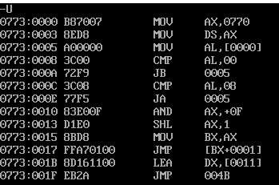

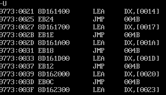

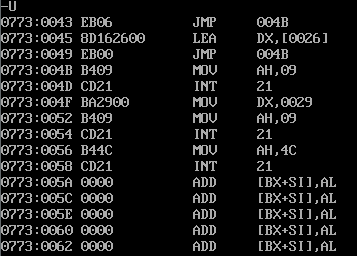

执行`U`命令不仅可以查看反汇编结果是否通畅，更重要的是查看一些关键步骤的`IP`值以方便设置断点。

这里有几个关键断点值得记住，首先是程序起始地址，`IP=0000`；然后是读入`MODE`模式字的位置，`IP=0005`；随后是进入分支前的位置（对应于`JMP A[BX]`），`IP=0017`；以及进入`CEND`的起始地址，`IP=004B`;最后是程序的终止地址,`IP=0058`.

在这里我们默认写入MODE模式字为2，先正常执行，执行前使用R命令查看一下寄存器

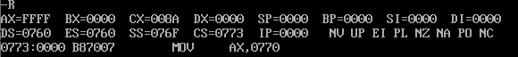

应用G命令，直接跳转到程序结尾

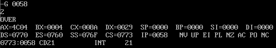

屏幕上出现字符‘2’，同时有我们设计的终止标注’`OVER`’，说明此次程序执行是正常的，完成了设计预期。同时观察寄存器的状态，可以发现`AX`被修改为`4C04`，这是因为向其高位`AH`传入了功能号`4C`，同时低位`AL`是`04`,对应于模式码2，`BX`被修改为`0004`，对应于地址表A的偏移地址;`DX`被修改为`0029`,这指向`OVER_MARK`的偏移地址；`DS`被修改为`0770`，由于段基地址是系统自动分配的，所以这一点我们并不关心。

查看一下此时数据段`DS`中的数据，按照设计，首字节是MODE模式字，随后16个字节（8个字（WORD））分别是`L0至L7`的偏移地址`IP`，对应于地址表`A`的区域，再随后是字符串`S0至S7`，最后是字符串`OVER_MARK`，通过刚才对寄存器的分析，`OVER_MARK`的首偏移地址为`0029`。执行D命令作具体查看，下面已经用图示的方法给出。

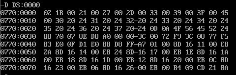

下面我们修改MODE为3测试一下程序的运行，同时这次多观察几个断点值

首先我们跳转到程序的起始位置，使用命令G，执行

```assembly
_G 0000
```

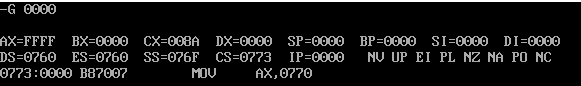

随后跳转到写入关键字的部分，由一开始反汇编的查看结果知道，此时`IP为0005`

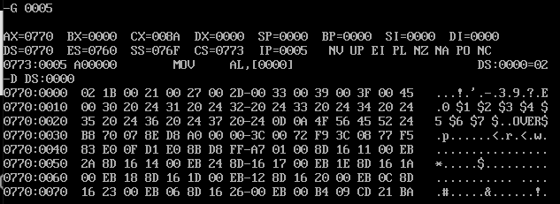

由此可见DATAS数据段已经被写入了，在这个位置修改`MODE`模式字的值为`3`，要使用命令`E`，其格式为

```assembly
_E address [list]
```

作用是对存储单元address中的数据作修改

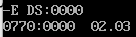

我们再查看一遍数据段状态

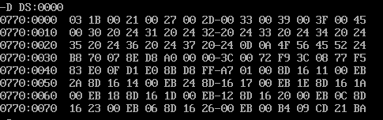

模式字已经被成功修改为03了。

然后我们继续执行到`IP=0017`，这是进入分支前的一步

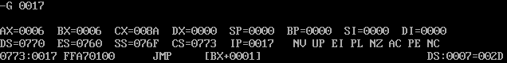

可以看到`BX`被修改为`0006`，这是地址表A要进入的偏移地址，此时`IP=0017`，再继续进行就有按照地址表进行跳转了

单步执行一次

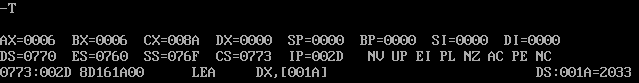

`IP`被修改为`002D`，这是进入了L3的分支内，此时`DX`仍为0000，下一步将被修改为S3的偏移地址（按照指令句

`LEA DX, S3`）

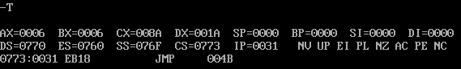

查看了程序执行的中间过程，符合我们的预期，跳转到程序末尾，查看一下结果

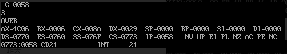

屏幕正确输出字符3，一切执行正常。

## 思考题1：

我们也可以用转移表法实现多分支，将要显示的字符存储在记为变量S起始的字符串中：

```assembly
S DW '0\$', '1\$', '2\$', '3\$', '4\$', '5\$', '6\$', '7\$'
```

然后同样将`MODE`模式字加载到`AL`中，将S地址加载到`DX`中，在一个循环中不断完成`AL`和`DX`值的修改，流程图如下：

本程序执行结果为，符合我们的预期，代码如下：

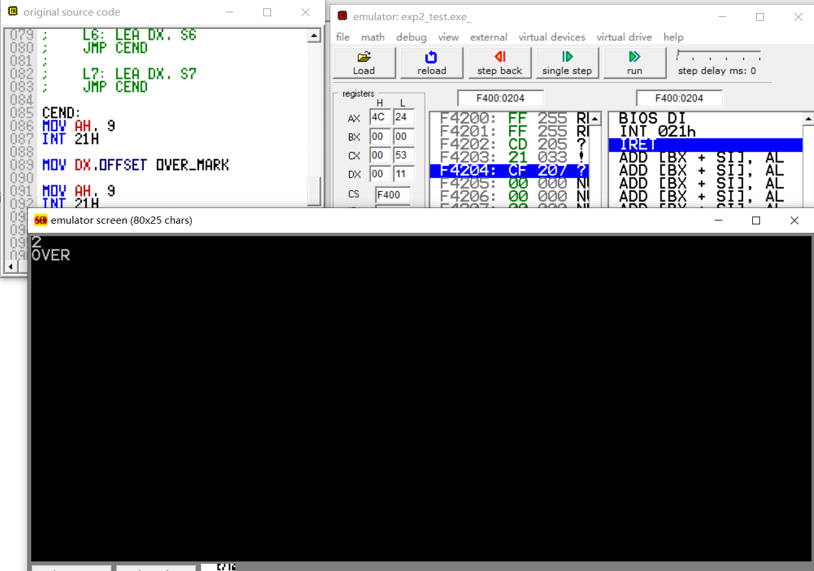

代码：

```assembly
DATAS SEGMENT

MODE DB 02H

S DW '0\$', '1\$', '2\$', '3\$', '4\$', '5\$', '6\$', '7\$'

OVER_MARK DB 0DH, 0AH, 'OVER\$'

DATAS ENDS

STACKS SEGMENT

;此处输入堆栈段代码

STACKS ENDS

CODES SEGMENT

ASSUME CS:CODES,DS:DATAS,SS:STACKS

START:

MOV AX,DATAS

MOV DS,AX

;此处输入代码段代码

GETNUM:

MOV AL, MODE

LEA DX, S

AND AX, 000FH

INC AL

SUB DX, 2

CMP AL, 0

JB GETNUM

CMP AL, 8

JA GETNUM

LOOP:

ADD DX, 2

DEC AL

JZ CEND

JMP LOOP

CEND:

MOV AH, 9

INT 21H

MOV DX,OFFSET OVER_MARK

MOV AH, 9

INT 21H

MOV AH, 4CH

INT 21H

CODES ENDS

END START
```

## 思考题2：

当在代码段中，写于不写程序开始标号“`START:`”和伪指令   ”`END START`“，在DEBUG程序调试中，观察段地址分配有什么不同？

我们在完成的代码中删去开始标号`“STA`RT:”和伪指令”`END START`“并再次编译，使用DEBUG程序，执行R命令，看一下各段地址尤其是CS的分配情况

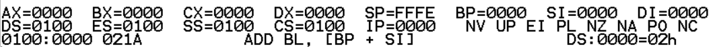

与写了标号“`START`:”和伪指令”`END START`“的情形相比

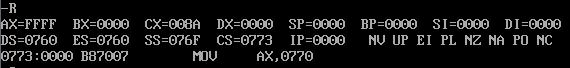

可以看出，当未指明`START`时，数据段`DS`，附加段`ES`，代码段`CS`和堆栈段`SS`的段基地址是一样的，也就是重合在一起的。同时，程序会从第一行，也就是`DATAS`的声明开始

根据下面这张截图

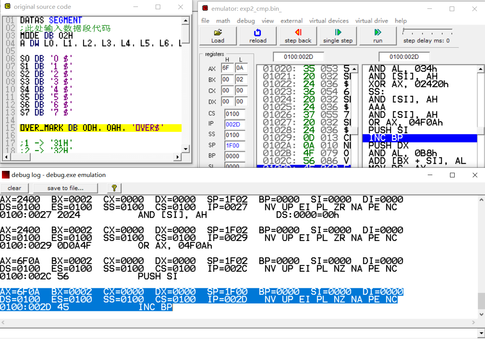

我们可以看出，在未声明标号“`START`“的前提下，程序从首行开始执行，包括如`DW, DB`这样的数据定义伪指令；与之不同的是，如果我们写了标号“`START`“并有”`END START`“结尾，则程序从这里执行（从我们一开始对CS

和`IP`寄存器的值的分析可以看出），而前面的部分，如`DATAS`数据段的定义，地址表A的定义等等，这些用伪指令写成的语句都已经由汇编程序事先完成对应的工作了。

所以在通常的代码写作中，我们要使用良好的代码框架，这样既方便了实际的运行工作，又提高了可读性。
