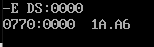

# 实验名称  循环程序设计

1.  实验内容、目的与要求

实验内容：

编写一段程序，在数据段的十个数据单元中，定义20个无符号8位无符号数（或键盘输入），找出最大数和最小数，分别送MAX和MIN单元。要可以显示原始数据，最大值和最小值

实验目的：熟悉编辑，汇编，链接和调试程序在DOS系统状态下的书写格式。熟悉编辑和调试程序中的常用命令的使用方法。熟悉循环结构在程序中的作用。

实验要求：

1.  所编写的程序要用段语句定义子段：数据段，堆栈段和代码段，用变量和符号来定于一地址，用符号来定义常量，原始数据用初始化变量来存储以及保留空单元，分段结构应符合ASM_86汇编规定

2.  用文本编辑器对所编写的源程序进行编辑，形成ASM文件存于磁盘上。熟练掌握编辑程序中的常用命令，用插入、替代、删除来编辑和修改源程序，用退出和存盘来结束编辑。

3.  用汇编程序对.ASM源程序进行汇编，能够看懂报错信息，并可以重新对程序进行修改，直到汇编结束后无错误为止

4.  用链接程序对一个或多个OBJ文件进行链接，形成EXE可执行文件

5.  用调试程序对.EXE文件进行调试和运行。用U命令了解程序起始地址，标号和偏移地址；用R命令知悉CPU中各寄存器及标志的原始值；用T和G命令执行程序；用R和D命令验证程序执行过程中的中间结果和最终结果。

6.  实验原理与步骤

按照程序题目要求的内容，我们记存储20个无符号数的列表为BUF，并创建两个存储单元，分别为MAX和MIN用来存储发现的最大数和最小数。

冒泡排序或者冒泡找最大/最小值是一种基本的算法，以寻找最大值为例，其基本思想是先让MAX为数组的首元素，然后进入循环，逐次得到数组的各元素，在此过程中，如果该元素大于当前的MAX，则把MAX替换为当前元素；否则保持MAX值不变。当我们对数组循环一遍后，相当于每个元素都进行了一次比较，最终MAX存储的是数组的最大值。本程序利用冒泡算法完成最大/最小值查找，可以用流程框图表示为


因此，代码的核心部分是单次循环的设计，本程序主要借助于`CMP`指令完成判断并由跳转指令（包括有条件和无条件）进行分类讨论和循环。

先来介绍其中用到的几条指令，首先是比较指令`CMP`，基本格式为

```assembly
CMP OPRD1, OPRED2
```

它将计算`OPRD1-OPRD2`（对`FLAGS`中的各标志位可能产生影响），而并不将结果送入目标操作数。

`CMP`指令常于条件跳转指令一同使用，对于无符号数的比较大小，有两种常用到条件跳转指令，分别是JA,
`JB`，与一般的跳转指令一样的格式，其后跟随需要跳转到的label标志。具体的含义是这样的：`JA`
是高于/不低于等于转移，前有`CMP OPRD1, OPRD2`时对应于`OPRD1\>OPRD2`的情形；`JB`是低于/不高于等于转移，对应于`OPRD1\<OPRD2`的情形。

同时，题目要求打印出各元素，所以不妨将打印各元素的工作合并进该循环中进行，总的来看，本实验设计的循环部分为：

```assembly
CMPMAX:

INC SI

MOV DL, [SI]

CALL SHOW

CMP AH, [SI]

JA CMPMIN

MOV AH, [SI]

JMP GOON

CMPMIN:

CMP [SI], AL

JA GOON

MOV AL, [SI]

GOON:

DEC CL

JNZ CMPMAX
```

可以看到在单次循环中我们先比较`AH`与`[SI]`的大小，是`CMPMAX`，再比较`AL`与`[SI]`大小，是`CMPMIN`部分，最后进入`GOON`对`CL`减一进行循环计数，随后将再次进入循环（对应于`JNZ CMPMAX`,如果循环计数未为零的话）。此外，`CALL SHOW`是过程调用，是专为8位无符号数（两位16进制数）设计的`ASCII`转码方案。由于本实验的侧重点在于循环结果和冒泡算法的理解，这里就不详细展开`SHOW`部分代码的设计思路了（简要地说，是对于一个2位16进制数，分别对其高位，低位处理，要将0\~9转为‘0’\~‘9’，将A\~F转为‘A’\~‘F’，分别对应于`ADD X, 30H`和`ADD X, 37H`的处理）。

再说一下本实验中的一些小细节，首先是过程定义的格式，为

```assembly
CERTAIN_PROC PROC

PUSH AX

;CODE HERE

POP AX

RET

CERTAIN_PROC ENDP
```

注意要在前后将寄存器量放入堆栈中，并按照先入后出（FILO）的原则在结尾处顺次出栈（POP），同时RET不要省略。

具体循环的次数也是一个重难点，因为事先已经预置AH, AL的值（对应于`MOV AX,DATAS \\ MOV DS,AX`），实际的循环次数是`BUF`长度减一，所以要有

```assembly
DEC CL
```

这一点其实至关重要，如果不能正确得到循环次数，可能会多进行循环，这样就将其后的MAX
中的0错误地读了进去，致使`MIN`不为按照预期的结果。

*代码见末尾*


四、实验数据记录及实验结果

对实验编译完成后，根据报错信息进行修改，最终得到可执行文件*ASMEXP3.exe*。为了检验程序能够正常运行，首先整体执行一遍程序，结果为：


程序正常工作！下面我们具体进入一个循环过程来看，如前几次实验一样，我们首先使用`U`命令进行反汇编，以利用设置断点进行跳转


可以看到，程序的起始地址为`IP=0000`，进入循环的起始位置为`IP=001A`(对应于`INC SI`)，单次循环的结束地址为`IP=0030`（对应于`JNZCMPMAX`），程序终止位置为`IP=0059`，进入SHOW过程的起始位置为`IP=0072`。

下面先来查看一下数据段的内容


可见数据在执行前还未写入。跳转到第一个循环执行的地方，用`G`命令


有字符‘`ALL_LIST`’输出，同时可以观察到`AH=1A`,
AL=1A被置为数组的首元素，再次查看数据段，内容已经被写入了。

随后，我们跳转到单次循环结尾（`IP=0030`），按照算法，单次循环应当读入一个元素（应该是`1A`后的那一个，也就是22）,并分别于`AH`,`AL`比较


可以看到有字符`22`输出，表明当前循环要进行比较的元素是`22`，同时我们看到`AH`由`1A`转为`22`，说明程序执行正常，由于`22\>1A`，所以`AH`被填充进更大的`22`。而且我们看到`SI=0001`，`SI`是数组`BUF`的偏移地址，同样指向的元素是`22`,即（`[SI]=22`）

随后，我们继续跳转到循环末尾处，对应`IP=0032`（对应`MOV MAX, AH`）,执行`G`命令，有


可以看到屏幕上已经打印出了整个数组，同时值得关注的是`AX=9003`，即`AH=90`,
`AL=03`，说明此时最大值/最小值已经得到了结果。

最后，我们跳转到`IP=0059`处，此时程序已全部执行完毕，结果为


结果一切正常。

下面我们修改一下这个程序，修改数组`BUF`里的值，为此使用E命令，修改第一个元素为`A6H`,这样，再次执行程序，输出结果应当为`MAX:A6`，`MIN:03`



然后，我们移动IP到给AH,
AL赋值的位置`IP=0011`，再使IP移到结尾`0059`，观察程序运行结果


说明此程序具有一般性，符合我们的设计预期。

思考题1：采用冒泡法排序，并找出最大数`MAX`和最小数`MIN`

思考题2：直接采用DEBUG程序进行编辑、汇编和调试此程序，应如何实现?

如果直接使用DEBUG程序进行编辑汇编并调试程序，则不需要按照一般的代码框架来写，简单的来看可以分成几个步骤：

1.  使用E命令对数据区特定部分写入数组，这相当于汇编程序中

```assembly
DATAS SEGMENT

; DATA HERE

DATAS END
```

的数据部分

1.  将主要代码在DEBUG程序中编辑保存，使用A命令，这里只需要写入

```assembly
CODE SEGMENT

START:

;CODE HERE

CODE ENDS

END START
```

中的代码部分即可

1.  检查代码，完成调试，调试分析步骤与本报告中过程一致
2.  不要忘记对DEBUG程序中编辑的代码存盘，需要使用W命令。


```assembly
DATAS SEGMENT

BUF DB 1AH, 22H, 07H, 05H, 03H, 28H, 0FH, 90H, 30H, 15H, 45H, 43H, 56H, 5DH,
2AH, 3FH, 1BH, 52H, 17H, 49H

;BUF DB 1AH, 22H

MAX DB 0

MIN DB 0

LENGTH DB 14H

CRLF DB 0AH, 0DH, '\$'

LIST_CHARS DB 'ALL_LIST:',0DH, 0AH,'\$'

MAX_CHARS DB 'MAX:','\$'

MIN_CHARS DB 'MIN:', '\$'

DATAS ENDS

STACKS SEGMENT

STACKS ENDS

CODES SEGMENT

ASSUME CS:CODES,DS:DATAS,SS:STACKS

START:

MOV AX,DATAS

MOV DS,AX

; Print 'ALL_LIST'

LEA DX, LIST_CHARS

MOV AH, 09H

INT 21H

MOV CL, LENGTH

DEC CL ; 已经进行了一次初始赋值，迭代次数-1

MOV AH, [SI]

MOV AL, [SI]

MOV DL, [SI]

CALL SHOW

CMPMAX:

INC SI

MOV DL, [SI]

CALL SHOW

CMP AH, [SI]

JA CMPMIN

MOV AH, [SI]

JMP GOON

CMPMIN:

CMP [SI], AL

JA GOON

MOV AL, [SI]

GOON:

DEC CL

JNZ CMPMAX

MOV MAX, AH ;Write to MAX

MOV MIN, AL ;Write to MIN

LEA DX, MAX_CHARS

MOV AH, 09H

INT 21H

MOV DL, MAX

CALL SHOW

LEA DX, MIN_CHARS

MOV AH, 09H

INT 21H

MOV DL, MIN

CALL SHOW

MOV AH, 4CH

INT 21H

PRINT_ASC PROC

PUSH AX

MOV AL, 0AH

CMP AL, DL

JA INUM

ADD DL, 37H ; ‘A’ = 41H, ‘B’ = 42H, …

JMP TEND

INUM:

ADD DL, 30H ; ‘0’=30H, ‘1’ = 31H, …,

JMP TEND

TEND:

MOV AH, 2

INT 21H

POP AX

RET

PRINT_ASC ENDP

SHOW PROC

PUSH AX

PUSH DX

MOV DH, DL

AND DL, 0F0H

SHR DL, 4

CALL PRINT_ASC

MOV DL, DH

AND DL, 0FH

;ADD DL, 30H

CALL PRINT_ASC

LEA DX, CRLF

MOV AH, 9

INT 21H

POP DX

POP AX

RET

SHOW ENDP

CODES ENDS

END START
```

