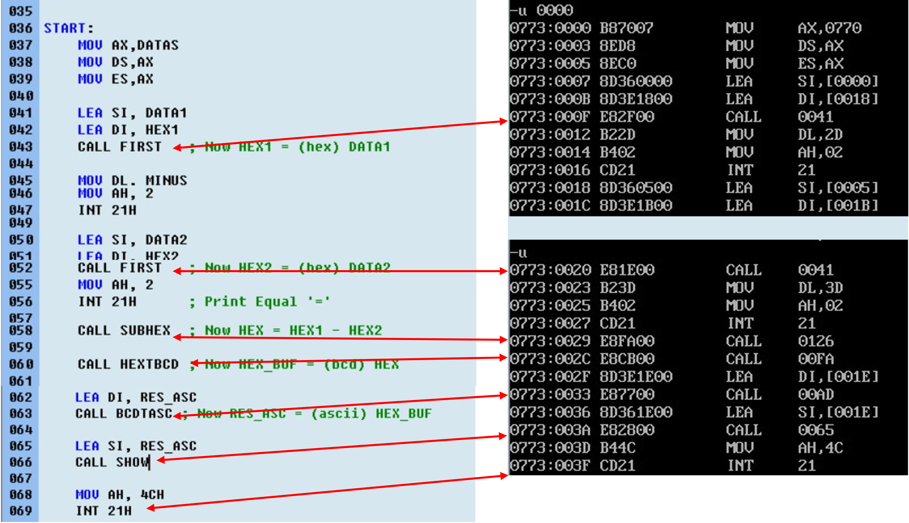
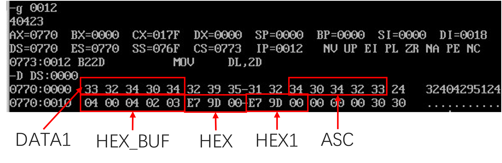

# 多位数程序设计

### 实验内容、目的与要求

**实验内容**

将两个多位二进制数相减，要求被减数悉编辑，汇编，链接和调试程序在DOS系统状态下的书写格式。熟悉编辑和调试程序中的常用命令的使用方法。熟悉循环结构在程序中的作用。

**实验要求**

1.  所编写的程序要用段语句定义子段：数据段，堆栈段和代码段，用变量和符号来定于一地址，用符号来定义常量，原始数据用初始化变量来存储以及保留空单元，分段结构应符合*ASM_86*汇编规定

2.  用文本编辑器对所编写的源程序进行编辑，形成*ASM*文件存于磁盘上。熟练掌握编辑程序中的常用命令，用插入、替代、删除来编辑和修改源程序，用退出和存盘来结束编辑。

3.  用汇编程序对*.ASM*源程序进行汇编，能够看懂报错信息，并可以重新对程序进行修改，直到汇编结束后无错误为止

4.  用链接程序对一个或多个*OBJ*文件进行链接，形成*EXE*可执行文件

5. 用调试程序对*.EXE*文件进行调试和运行。用U命令了解程序起始地址，标号和偏移地址；用R命令知悉CPU中各寄存器及标志的原始值；用T和G命令执行程序；用R和D命令验证程序执行过程中的中间结果和最终结果。

   


**实验原理与步骤**

根据实验报告和题目要求，首先绘制实验的程序框图，如


1.  #### 显示被减数与减数

程序的第一步就是对减数和被减数的显示，按照程序要求：被减数，减数均以
ASCII码形式按顺序存放在以`DATA1`和`DATA2`为首的5个内存单元中(低位在前)，这里的低位在前尤其值得我们关注，由于我们通常将高位写在头起，所以这里的显示需要对每段作倒序处理。例如我们希望表示多位十进制数`40423`（这是一个简单的测试数，没有别的原因），就需要拆分在`DATA1`单元中的形式为

```assembly
DATA1 DB '3', '2', '4', '0', '4'
```

我们希望在屏幕上的显示为 ‘`40423`’，所以按照减序的读法即可。为了程序扩展上的方便，我们先初始化由高位到低位显示的字符串`ASC`(对应于`ASC DB 5 DUP('0')`)，我们让`SI`表`DATA1`的首地址，`DI`表`ASC`的首偏移地址，在循环过程中，让`BX`表`DATA1`当前元素相对偏移地址，每次`BX`减一，`DI`加一，经过`LENGTH`次循环后即可以得到`DATA1`的倒序输出存放在`ASC`字符串中。最后，调用功能号为`09H`的`INT 21H`中断打印`ASC`字符串。核心代码为

```assembly
LEA DI, ASC

MOV CL, LENGTH

XOR BX, BX

MOV BL, CL

INNERLOOP:

MOV BX, CX

DEC BX

MOV AL, SI[BX]

MOV [DI], AL

INC DI

DEC CL

JNZ INNERLOOP

; Print the ASC

LEA DX, ASC

MOV AH, 09H

INT 21H
```

我们经过调试，下图展示了执行该过程后的数据段情况，可以看到`DATA1`和`ASC`是倒序关系，符合我们的预期。


2. #### 被减数和减数（ASCII码表示，十进制）转换为十六进制数

这个部分是本次实验的重难点之一，我们用程序框图表示转换过程


举个例子，仍以‘`40423`’为例，它在数据段的存储形式为`34H 30H 34H 32H 33H`，预处理的一步，就是写为BCD码，按照ASCII的对应关系，只需要对每元素均减去`30H`就可以得到`HEX_BUF`。这一步的核心代码为

```assembly
LEA DI, HEX_BUF

MOV CL, LENGTH

ASCTBCD:

MOV AL, [SI]

SUB AL, 30H

MOV [DI], AL

INC DI

INC SI

DEC CL

JNZ ASCTBCD
```

我么同样进行调试，类似地，通过查看数据段的数据存储情况，得知程序工作正常


然后就是将5位的BCD码转换成16位进制数的过程，由于5位BCD码取值为`00000\~99999`对应`000000H~01869FH`，所以我们为转换结果HEX预留三个字节（对应`HEX DB 5 DUP(0)`），具体的算法是，重复“**高位\*10（0AH）+低位**”的过程，以数据40423为例，有$$40423
= 3 + 10 \times (2 + 10 \times (4 + 10 \times \left( 0 + 10 \times 4
\right))))$$。按照这样的循环逻辑，我们应该从高位到低位读入数据，因此可以基于已经倒序（从高位到低位）ASC的字符串经`ASCTBCD`生成的`HEX_BUF`完成这一操作。

我们复习一下有关无符号数乘法指令的相关知识，基本格式为`MUL OPRD`，为单操作数，说明这里有另一操作数缺省给出，对于字节乘法，即`OPRD`是一个字节长时，将进行`OPRD`与`AL`的字节乘法，结果是一个字（`WORD`）送入`AX`中；对于字乘法，此时`OPRD`是两字节长，这里是将`OPRD`与`AL`的字乘法结果送往`DX:AX`——这么表示意味着高位送往`DX`，低位送往`AX`。源操作数`OPRD`可以是8位或16位的寄存器或存储器，但不能为立即数。

同样的，我们用将其写在过程`BCDTHEX`里，给出这里的核心代码为

```assembly
LEA SI, HEX_BUF

LEA DI, HEX

MOV BX, 000AH

XOR AX, AX

MOV CL, LENGTH

BCDTHEX:

MUL BX

ADD AL, BYTE PTR[SI]

ADC DX, 0

INC SI

DEC CL

JNZ BCDTHEX

MOV WORD PTR[DI], AX

MOV [DI+2], DL
```

整合一下，我们目前已经设计了将字符串倒序（`DATA1`存放的顺序是由低向高）并在屏幕打印其结果的程序`SHOW`，对ASCII编码字符串预处理，转为BCD码（具体由高位向低位或是由低位向高位由传入的字符串决定）的程序`ASCTBCD`，以及将BCD最终转码为16位数值（这里要求BCD串当是由高位向低位的）的程序`BCDTHEX`，如果我们希望将`DATA1`中的数据（`DATA1 DB '3', '2', '4', '0', '4'`）转换成对应的16进制数`9DE7H`(`9DE7H = 40423`)（并存储在`HEX`中——如果我们希望从中取出，可以随后利用相关的串传送命令），这个过程是

```assembly
LEA SI, DATA1

CALL SHOW

LEA SI, ASC

CALL MAKEHEXBUF

CALL GENHEX
```

执行一遍，利用调试工具，可以清楚地看到数据段内的数据存储情况如下图所示


3. #### 多位十六进制数相减

接下来到了关键的运算环节，也是程序的主要部分，多位16进制相减。

首先不妨设被减数为40423，存放在`DATA1`中（`DATA1 DB '3', '2', '4', '0', '4'`）；减数为`21592`，存放在`DATA2`中（`DATA2 DB '2', '9', '5', '1', '2'`），数据为经过前两步处理，得到对应的十六进制数`HEX1`, `HEX2`（它们均为3个字节长， `HEX1`数据为 `00 9D E7H`， `HEX2`数据为`00 54 58H`(均由高位向低位)）。多位数的相减过程，需要用到借位相减指令`SBB`，其格式为`SBB OPRD1, OPRD2`，是将`OPRD1 - OPRD2 - CF`的结果送往`OPRD1`，专门用于多字节的相减。还要注意，由于最低位起始不被借位，所以在起始应置`CF=0`，这可以使用指令`CLC`(零操作数指令)

在这里，我们将计算结果送入`HEX`中，给出其核心代码为

```assembly
LEA SI, HEX1

LEA DI, HEX2

LEA BX, HEX

MOV CL, 3

CLC

SUBTRACT_LOOP:

MOV AL, [SI]

SBB AL, [DI]

MOV [BX], AL

INC BX

INC SI

INC DI

DEC CL

JNZ SUBTRACT_LOOP
```


4. #### 将结果转换为ASCII码输出

这一步与前面的第二步正好是一个逆过程，要将16进制数转码成ASCII码，同样可以分成两个步骤，首先转成BCD码，再转成对应的ASCII码。接续上面的例子，计算结果`40423-21592=18831=498F`。`498F`按照由低至高的顺寻存放在`HEX`中，转成BCD码按由低位至高位的顺序应当是`01,03, 08, 08,01`。再转成ASCII码（同样是由低位至高位）是`31H, 33H, 38H, 38H,31H`。这个过程可以用下面的程序流程图表达


总结一下，当我们存储在`HEX1`和`HEX2`中的16进制数相减后，将计算结果存放在`HEX`中（由由低位至高位），然后通过`BCD`转码存放在`HEX_BUF`（串）中（由由低位至高位），最后再将BCD码转成ASCII码存放在`RES_ASC`（串）中（由由低位至高位）。下面给出由十六进制数转BCD的核心代码（封装在过程`HEXTBCD`中）

```assembly
LEA SI, HEX ; HEX -\> HEX_BUF

LEA DI, HEX_BUF

XOR DX, DX

MOV AX, WORD PTR[SI]

MOV DL, [SI+2]

MOV BX, 000AH

INNER_HEXTBCD:

DIV BX

MOV BYTE PTR[DI], DL

MOV DX, 0

INC DI

CMP AX, 0

JNZ INNER_HEXTBCD
```

继续给出BCD码转ASCII码的核心代码（封装在过程`BCDTASC`中）

```assembly
LEA SI, HEX_BUF ; HEX_BUF -\> [DI] (RES_ASC)

MOV CL, LENGTH

INNER_BCDTASC:

MOV AL, BYTE PTR[SI]

ADD AL, 30H

MOV BYTE PTR[DI], AL

INC SI

INC DI

DEC CL

JNZ INNER_BCDTASC
```


这一步结束后，由于`RES_ASC`中存储的ASCII码顺序是按照数位由低至高的顺序排布的，所以不能够直接输出（输出的结果应该是由高位到低位），我们可以直接调用前面的`SHOW`子程序，将`RES_ASC`存储的字符串倒序记录到`ASC`中并输出。整合起来，主程序应该写为

```assembly
CALL SUBHEX ; Now HEX = HEX1 - HEX2

CALL HEXTBCD ; Now HEX_BUF = (bcd) HEX

LEA DI, RES_ASC

CALL BCDTASC ; Now RES_ASC = (ascii) HEX_BUF

LEA SI, RES_ASC

CALL SHOW
```

本实验用到的[完整代码](https://github.com/pacria/AsmDemo/blob/homework/exp4/MAIN.asm)

### 实验数据记录及实验结果

对汇编程序编译完成后，根据报错信息进行修改，最终得到可执行文件*ASMEXP4.exe*。首先我们完整运行一遍，屏幕上有字符显示为


这与我们正常的计算结果是一致的（即$40423-21592=18832$），下面我们更深入地查看一下数据段的情况，使用DEBUG程序中的`D`命令即可，各字段为


可见各字段的情况都是在预期中的，程序执行过程正常。为了测试程序的通用性，我们修改`DATA1`要表示‘`98721`’， `DATA2`要表示‘`32994`’——即相关数据定义伪指令为`DATA1 DB '12789' DATA2 DB`
`'49923'`，再次整体执行一遍，得到屏幕输出为


运算结果正常！下面我们再测试一次，实验中仅要求数据占5个内存单元（即5位数），我们测试一下6位数的情况，任意取数，使`DATA1`为`902312`，`DATA2`为`879923`——即有`DATA1  DB '213209'` `DATA2 DB '329978'`，注意同时要修改`LENGTH`为6（对应于`LENGTH EQU 6`）同时修改`ASC`与`HEX_BUF`字段长度（分别对应于`ASC DB 6 DUP('0'), '$' ` `HEX_BUF DB 6 DUP(0)`），观察执行结果


可见执行结果同样正常


下面我们通过设置断点的方式对程序的几个关键步骤进行单元测试。通过执行反汇编命令，可以查看一些关键节点的`IP`段，下图展示了对主程序反汇编的结果



我们首先检查数据段的情况，这时代码并未执行，应处于随机状态


然后我们跳转到断点`IP = 000F`处，即将对`FIRST`（按照前面的设计，FIRST子程序主要是将`DATA1`/`DATA2`转成16进制数存放在`HEX1`/`HEX2`中）进行调用


注意到这里`SI=0000`对应于`DATA1`的首偏移地址，`DI=0018`对应于`HEX1`的首偏移地址，再查看一下数据段的情况，如红框中标出的那样，`DATA1`和`DATA2`中的数据已被写入了。


我们直接跳转到`FIRST`子程序结束处，让`IP`等于下一行即`IP=0012`，再次查看数据段如下



可见屏幕上打印出了字符’`40423`’，同时数据段的`ASC`，`HEX_BUF`等均以按要求写入，`DATA1`被转成16进制数`9DE7H`存放在`HEX1`里。

接下来我们查看将`DATA2`转成16进制数存放在`HEX2`中的结果，根据反汇编的指示，跳转到`IP=0023`处，DEBUG结果为


可见`HEX1`和`HEX2`单元都已经被写入数据，`HEX2`中存储数据`5458H`正是`DATA2`转成16进制数的结果（`5458H` = 21592）。同时屏幕上打印出’`-21592`’的结果。

下面考虑多位数减法的计算过程，在设计之时，我们安排这由子程序`SUBHEX`完成，将`HEX1`中的数据由低位至高位与`HEX2`完成借位减法，结果送入`HEX`中。为了查看子程序的执行情况，应该跳转至`IP=002C`处


注意得到，`HEX`中已经存放了数据`498FH`，这正是两数相减的结果。我们可以容易作一验证：

其中`498FH` = 18831 = 40423 - 21592 = `9DE7H` - `5854H`。

继续执行下去，随后来到了子程序`HEXTBCD`的执行部分，这是将HEX中的数据转成（按字节）BCD码写入到`HEX_BUF`中去，由于`498FH`= 18831，所以我们可以预先推断`HEX_BUF`中的数据应为`01 03 08 08`
`01`，仍然通过断点工具查看


结果确实不出所料，我们继续执行对下一个单元的测试——这是子程序`BCDTASC`的执行部分，仍然设置断点，查看执行结果如下图所示


由BCD码转成的ASCII码已经被写入`RES_ASC`中了。

现在，我们已经接近程序的末尾了，跳转至程序末尾，应该可以观察到屏幕上打印出倒序后的`RES_ASC`字符串（因为`RES_ASC`的数位顺序是由低到高，习惯显示的顺序是由高到低），同时如果查看数据段，此时`ASC`被写入这个串值，执行结果为


