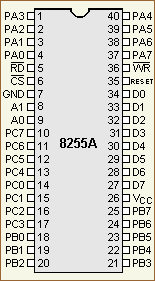
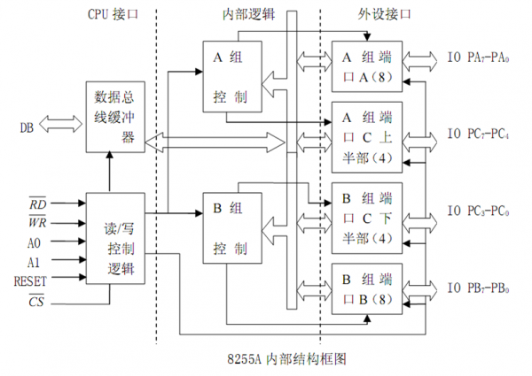
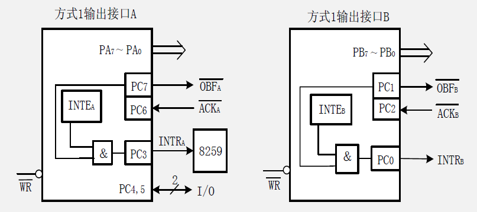
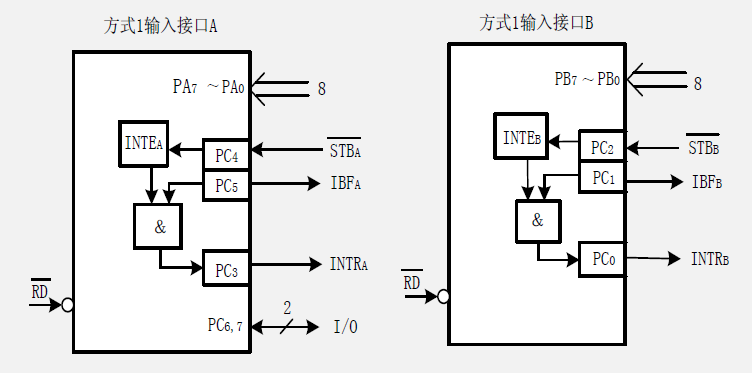
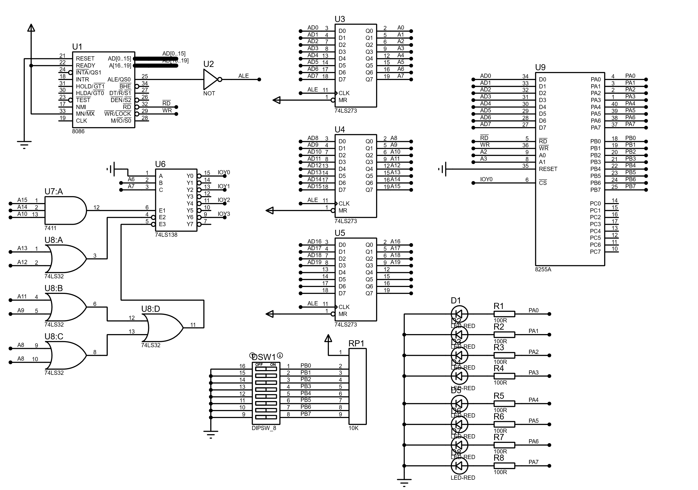
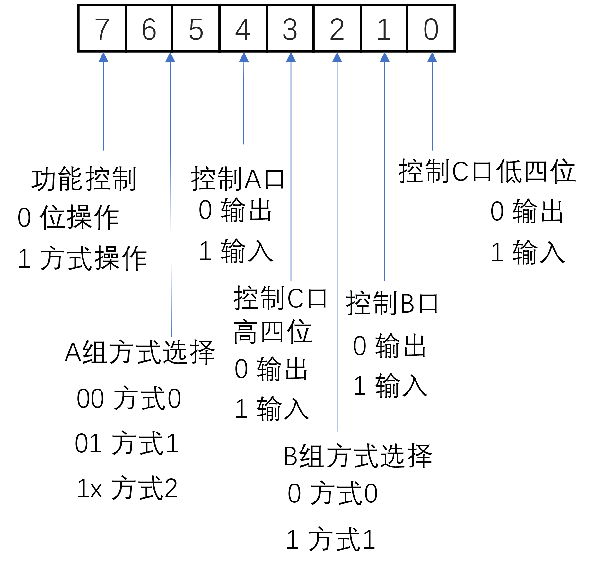
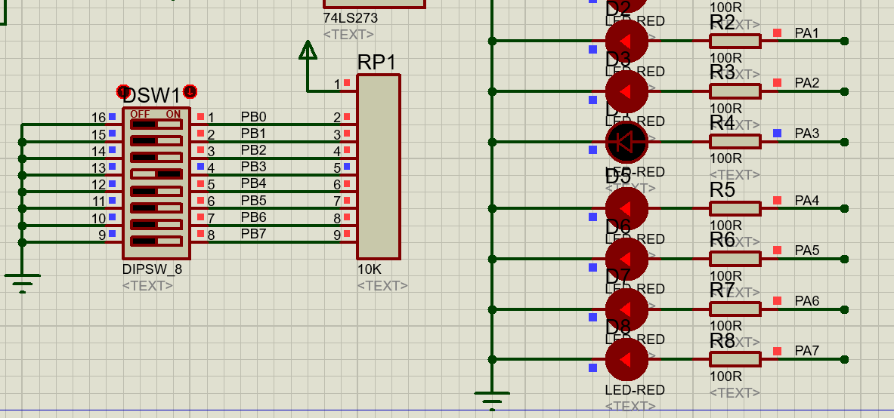

# 5-1 基本输入输出实验

>   8255 基本输入输出
>
>   Source Project: https://github.com/pacria/AsmDemo/tree/homework/Proteus_work/BASIC


### 实验内容

编写程序，使8255的A口为输入，B口为输出（均工作在方式0下），完成拨动开关道数据灯的数据传输（这里的输入输出方式是无条件传送方式，因为无论开关和数码灯都是简单器件）。要求只要改变开关，数据灯的显示就要发生相应改变。


### 实验原理

本实验主要使用8255这种可编程并行接口，它有40个引脚，如下图所示

<div align=center></div>

<div align=center>8255引脚图</div>


这些引脚按类型分有如下功能：

`D0`\~`D7`：这是双向数据传输线，用于传输数据和控制字

`#RD`：这是读信号线，低电平有效。`#RD`通常接系统总线的`#IOR`实现对8255接口的读操作

`#WR`：这是写控制线，同样低电平有效。`#WR`通常接系统总线的`#IOW`完成对8255的写操作

`#CS`：这是片选信号线，低电平有效。在使用时，将系统地址信号经译码（可以通过逻辑门，也可以通过译码器如74LS138）产生低电平选中8255芯片。硬件的译码电路要与软件中使用的接口地址对应

`A0`, `A1`：这是口地址选择信号线， `A0`, `A1`线上的组合经片内译码可以产生四个有效地址，用来完成片内寻址，如下表所示：

<div align=center></div>

在使用中，`A0`, `A1`常接系统总线的`A0`, `A1`，与\#CS一起决定8255的接口地址。

`RESET`：复位输入信号，常接系统的RESET端，当其为高电平下8255复位。复位后的状态是A口，B口，C口均作输入状态

`PA0`\~`PA7`：这是A口的8条输入输出信号线

`PB0`\~`PB7`：这是B口的8条输入输出信号线

`PC0`\~`PC7`：这是C口的8条输入输出信号线

8255内部的逻辑框图如下，其事实上只有两组控制单元，C的高四位和低四位是分开的。

<div align=center></div>

<div align=center>8255内部框图</div>

关于A口，B口，C口具体用作输出或是输入或是双向皆可，可以由软件编程指定，有三种工作模式，分别是方式0，方式1和方式2——本实验三个分实验其主要工作在方式0和方式1下，故对这两种工作方式作一介绍：

1.  方式0：又可称为基本输入输出方式，此方式下，A口和B口分别定义为输入或输出（后面看到是通过初始化环节中输入状态字实现），C口有按位进行置位和复位的能力（后面看到是通过位控制字实现）。此工作方式最适合于无条件传送方式。

2.  方式1：也即选通控制方式，A口或B口仍可作为输入或输出口（但不能双向），且在选通控制信号下完成。下图展示了方式1下A,
    B用作输出接口的引脚接法示例。

<div align=center></div>

<div align=center>8255方式1输出引脚示图</div>

下图展示的是A, B用作输出接口的引脚接法。

<div align=center></div>

<div align=center>8255方式1输入示图</div>


可以注意到，在此情形下，C组部分是用于作选通信号了。


### 实验过程

在[综合实验平台](https://github.com/pacria/AsmDemo/tree/homework/Proteus_work/BASIC)（自建）上，我们利用8255主片进行实验。其译码地址为`8000H`~`8006H`，对应的部分为

```assembly
IOY0 EQU 8000H    ; IOY0-8255
MCU8255A    EQU IOY0+00H     ; Output
MCU8255B    EQU IOY0+02H     ; Input
MCU8255C    EQU IOY0+04H     ; For more
MCU8255MODE EQU IOY0+06H     ; Mode Control
```


然后，我们将A口用于输出，B口用于输入，所以A口接LED阵列，B口接拨码开关阵列。设计B输入开关处于ON状态时为高电平，A接LED发光时为高电平，这样就可以将B的输入直接与A的输出对应起来（不需要取反这样的操作），对应的输入输出电路为

<div align=center></div>


同时给出（老的）总实验接线图为（请放大查看），其中MN/\#MX引脚接高电平，8086工作在最小模式下。

<div align=center></div>


完成等硬件电路的搭建后，我们来考虑一下软件的设计，8255通过控制字的方式设置它的工作方式，控制字有两种，一种是状态控制字，用来指定A,B,C口各状态——工作在方式0，方式1或方式2，作输入或输出；第二种是位控制字，前面说到C口可以按位置数，位控制字就是用于这种初始化。其中，方式控制字的格式为

<div align=center></div>

<div align=center>8255方式字</div>

所以可以看出这里的方式控制字应为`1000x01xB`，C口没有用到，就将这里的X记为0，所以状态控制字应为`10000010B`即`82H`。拨动开关阵列接B端口作输出，LED阵列接A端口作输出。使用无条件传送方式，从B口读入并行开关数据，再送入A端口。为了让这个过程可以持续下去，故放在一个永久循环中。

另外补充一点，由于涉及到端口的数据传送，需要指令`IN`, `OUT`，下面简要介绍一下其格式：

其中使用指令`IN`的格式为

```assembly
IN acc, port
```

其中`port`要求为一个8位的立即数，表明从`port`指明的地址位中读取数据到`acc`。与这种直接寻址相比，间接寻址使用范围更广，格式为

```assembly
IN acc, DX
```

16位的端口地址由DX给出；对于指令OUT，同样有直接寻址

```assembly
OUT port, acc
```

和间接寻址

```assembly
OUT DX, acc
```

两种，要被送出的数据为`acc`。

在[综合实验平台](https://github.com/pacria/AsmDemo/tree/homework/Proteus_work/BASIC)（自建）上，将源代码定位到`EXP0`处，按照上述思路，通过无条件查询方式，写出`EXP0`段的代码为

```assembly
EXP0:  

   MOV DX, MCU8255MODE
   MOV AL, 10000010B       ; A - Output(Method0) B - Input(Method0)
   OUT DX, AL

EXP0_ENDLESS:
   MOV DX, MCU8255B
   IN AL, DX

   MOV DX, MCU8255A
   OUT DX, AL
   JMP EXP0_ENDLESS
      
   JMP TEND
```


### 进行实验

对主程序进行编译，应该可以看到编译正常的提示`Compiled Successfully`。


然后进行仿真，在proteus工具中，仿真的选项如下

<div align=center></div>


在仿真过程中，首先进行实验类型的选择，按下对应于EXP0的按钮（BUTTON)，此时程序即进入`EXP0`段

<div align=center></div>

可以看到LED阵列起初是全亮的，调动拨动开关的一位至OFF，发现对应的LED灭灯。再调至ON，对应的LED又重新亮起

<div align=center></div>


调节拨动开关的其他位，也出现同样现象，验证程序执行正常，这是一个简单的无条件输入输出过程。

