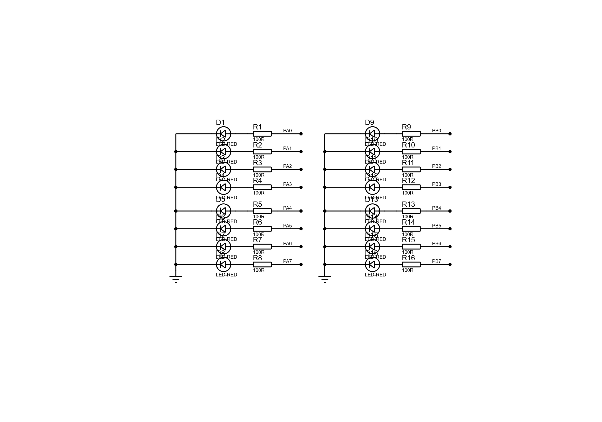
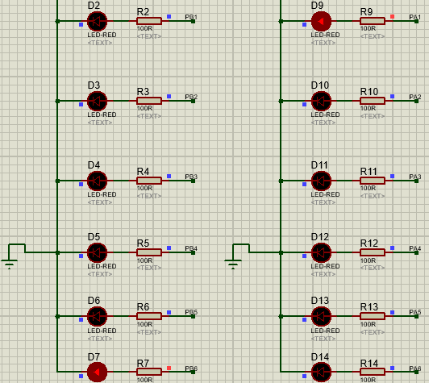

# 流水灯显示实验

> Flowing Lights  8255 
>
> Source Project: https://github.com/pacria/AsmDemo/tree/homework/Proteus_work/BASIC
>
> Previous          : https://github.com/pacria/AsmDemo/tree/homework/exp5_1


### 实验内容

使8255的A口和B口均作输出（同样均工作在*方式0*下），数据灯`D7`\~`D0`由左至右，每次仅亮一个灯，循环显示，`D15`\~`D8`与`D7`\~`D0`正相反，由左至右，每次仅点亮一个灯，亦为循环显示

1.  实验原理：

实验二是流水灯实验，复述一下实验要求：数据灯`D7`\~`D0`由左至右，每次仅亮一个灯，循环显示，`D15`\~`D8`与`D7`\~`D0`正相反，由右至左，每次仅点亮一个灯，循环显示

在这个实验中，8255的A口和B口均作输出——也即均工作在方式0下，在实验一的基础上，我们可以稍加改进，使得B口同样接一个8单元LED阵列即可。




首先来考虑状态控制字，由于这里A口和B口均用作输出端口，很容易确定控制字为`10000000B`即`80H`。对于流水灯的设计，按照实验书上的要求，`PB0`\~`PB7`分别接`D0`\~`D7`，`PA0`\~`PA7`分别接`D8`\~`D15`，且初始是`D0`, `D15`发光，流水顺序是`D0`-\>`D7`, `D15`-\>`D8`然后折返。

根据这些要求，可以知道首先对A口输出数据为`10000000B`即`80H`，B口输出数据为`00000001B`即`01H`。在接下来的循环中，A口输出数据在时间上应当循环右移，B口输出数据应当循环左移。从指令上讲，循环移位指令又有带进位标志位和不带进位标志位两种，这里使用不带进位标志位的循环移位指令——左移`ROL`，右移`ROR`

在[综合实验平台][https://github.com/pacria/AsmDemo/tree/homework/Proteus_work/BASIC]（自建）上，由于只有PA端口接了LED阵列，所以这里仅用PA端口的LED阵列流水灯示例说明大意。我们设置这是在`EXP1`段中执行的，所以将程序定位到`EXP1`处，代码如下：

```assembly
EXP1:
   MOV DX, MCU8255MODE
   MOV AL, 10000010B       ; A - Output(Method0) B - Input(Method0)
   OUT DX, AL

   MOV DX, MCU8255A
   MOV AL, 01H

EXP1_ENDLESS:
   CALL DELAY

   OUT DX, AL
   ROL AL, 1   
   JMP EXP1_ENDLESS

   JMP TEND
```


其中`DELAY`子程序为

```assembly
DELAY PROC NEAR
    PUSH CX
    MOV CX, 0FFFFH
D1:
    DEC CX
    JNZ D1
    POP CX
    RET
DELAY ENDP    
```


### 进行实验

像实验一那样，完成硬件电路布线后，编译程序，再导入到该proteus工程中，点击“仿真”按钮，可以观察到LED阵列像流水一样逐次亮起，两端的顺序是D0至D7（再折返），D15到D8。与我们的设计是一致的。

注意，如果实验过程中观察灯的亮灭过于频繁，可以调整DELAY子过程中的计数周期以得到合适的观感。





### OLD VERSION

> 这个版本逻辑与前一致，不过更接近原唐都实验中所列内容


### 设计思路

由于OUT指令限制了输出的数据只能存放在通用寄存器`AL`（输出字节）或`AX`（输出字）中，且涉及到两个流水灯工作，所以循环移位的变量应当单独定义两个，这里写作`DATA1`和`DATA2`，在每次循环中，`DATA1`先被取出传给`AL`，然后执行循环右移操作（对应于`ROR`
`AL`），为了保存变量，再将AL送回`DATA1`以便下一次操作，最终通过`OUT`指令，将8位的`AL`数据送出到A端口；`DATA2`的操作过程同理，用于控制B端口的LED亮灭。在实际应用上，由于主频较高，需要设置延时程序，这样才观察到明显的亮灭现象。演示程序的写法也很简单，只需要创造一个一定次数的循环体即可。


### 代码部分

```assembly

IOY0 EQU 0C400H ;片选IOY0对应的端口始地址

;\*\*\*\*\*\*\*\*\*\*\*\*\*\*\*\*\*\*\*\*\*\*\*\*\*\*\*\*\*\*\*\*\*\*\*\*\*\*\*\*\*\*\*\*\*\*\*\*\*\*\*\*\*\*\*\*\*\*\*\*\*\*\*\*\*

MY8255_A EQU IOY0+00H\*4 ;8255的A口地址

MY8255_B EQU IOY0+01H\*4 ;8255的B口地址

MY8255_C EQU IOY0+02H\*4 ;8255的C口地址

MY8255_MODE EQU IOY0+03H\*4 ;8255的控制寄存器地址


DATAS SEGMENT

DATA_A DB 80H

DATA_B DB 01H

DATAS ENDS


STACKS SEGMENT

DW 256 DUP(0)

STACKS ENDS


CODE SEGMENT

ASSUME CS:CODE. SS:STACKS, DS:DATAS

START:

MOV DX, MY8255_MODE ;初始化8255工作方式

MOV AL, 10000000B

OUT DX, AL

;初始化亮灯方式

MOV DX, MY8255_A

MOV AL, DATA_A

OUT DX, AL

MOV DX, MY8255_B

MOV AL, DATA_B

OUT DX, AL

GOON:

CALL DELAY

MOV DX, MY8255_A

MOV AL, DATA_A

ROR AL, 1

MOV DATA_A, AL

OUT DX, AL

MOV DX, MY8255_B

MOV AL, DATA_B

ROL AL, 1

MOV DATA_B, AL

OUT DX, AL

JMP GOON


DELAY PROC NEAR

PUSH CX

MOV CX, 0FFFFH

D1:

DEC CX

JNZ D1

POP CX

RET

DELAY ENDP


CODE ENDS

END START
```

