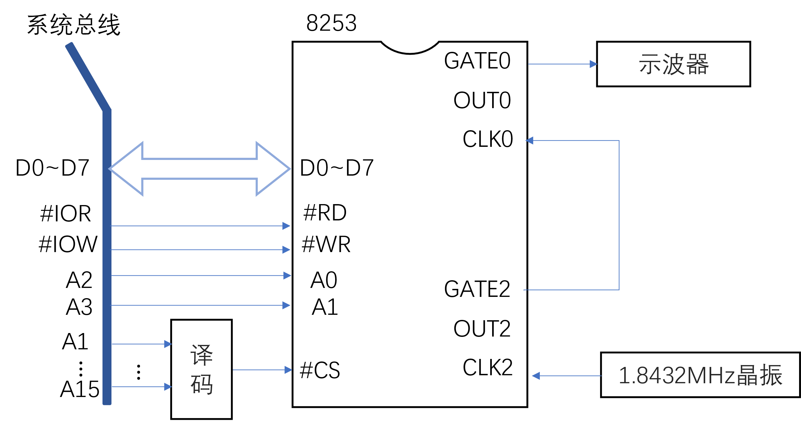
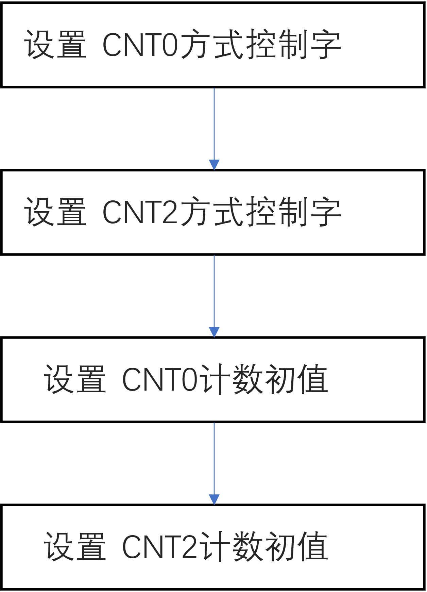
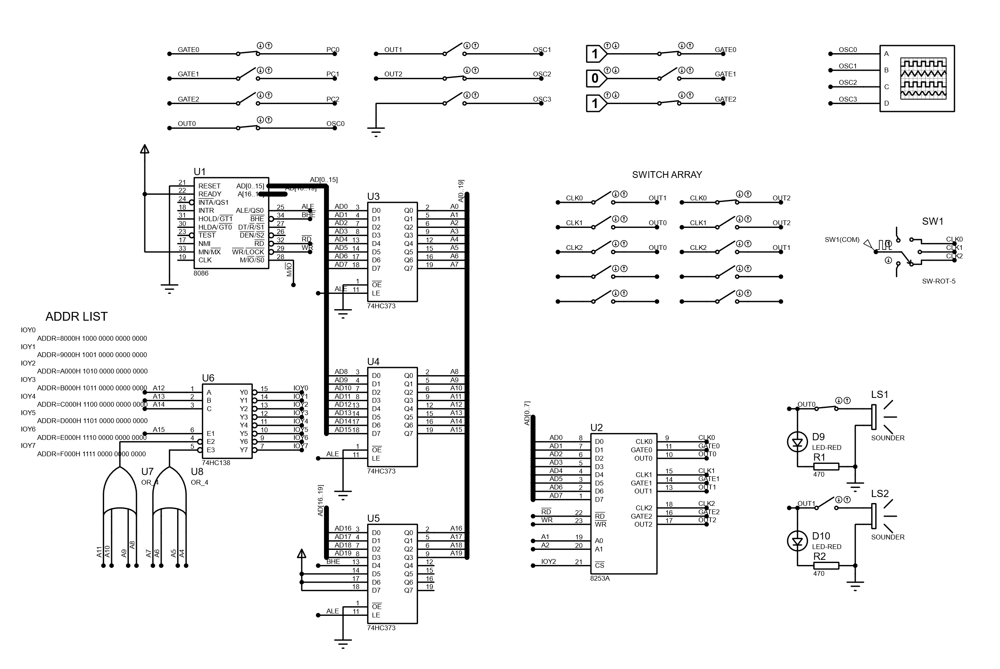
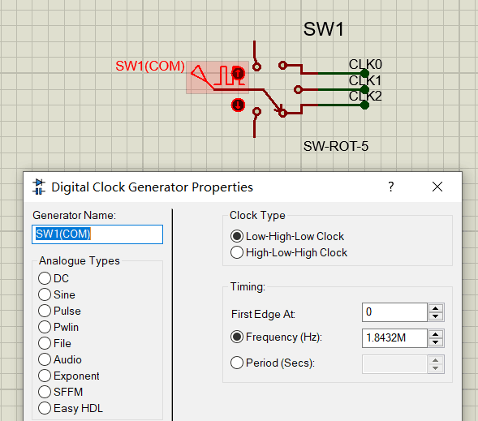
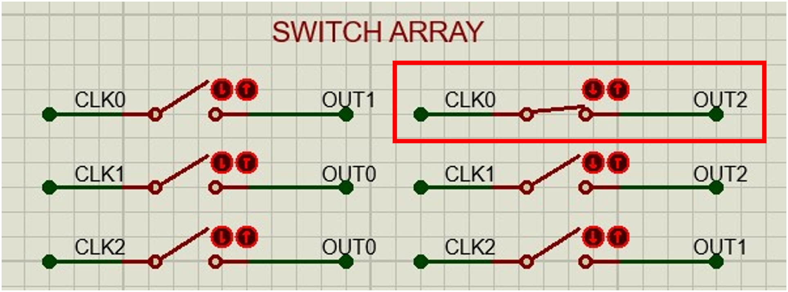
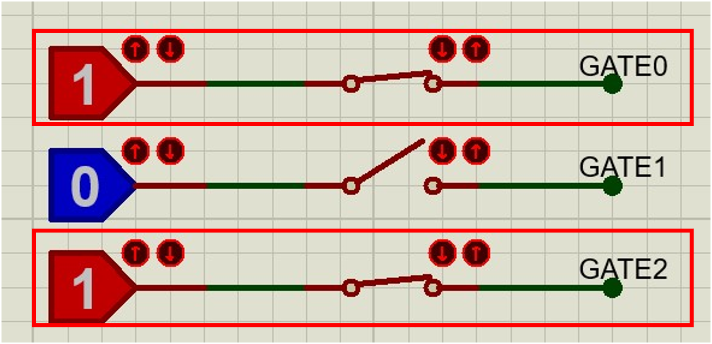
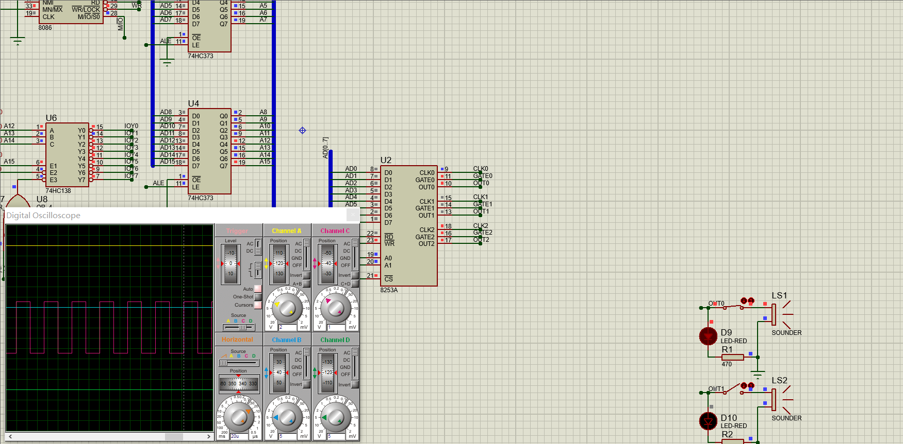
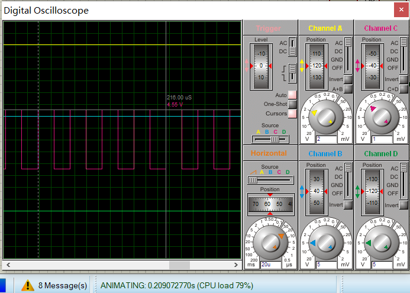
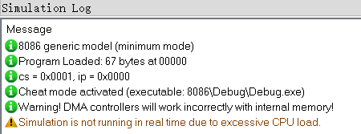
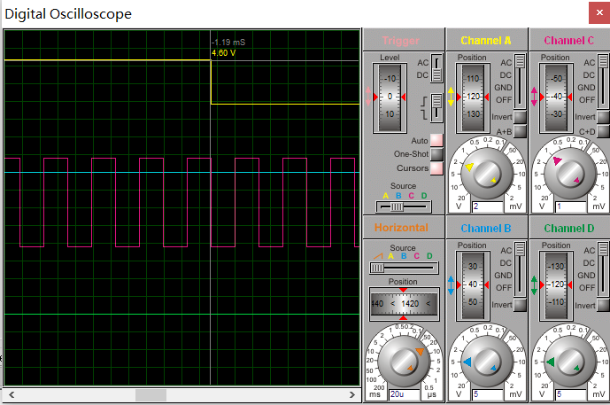

# 6-2 定时应用程序

> 8253 定时器
>
> Source Project: https://github.com/pacria/AsmDemo/tree/homework/Proteus_work/BASIC/source


### 实验内容

使用8253（参考书使用8254）的计数器2（CNT2）使其工作在方式3下，用信号源1.8432MHz作为CLK2时钟，计数初值设为100，即对`CLK2`进行100分频。理论上讲，`OUT2`输出频率应为18.432KHz。再将`OUT2`接到计数器0（CNT0）的`CLK0`，设置计数器0同样工作在方式3，计数初值为18432，将在`OUT0`得到1Hz的输出。


### 实验原理

在实践中，我们常常利用8253的几个计数器的独立性，使其一同工作完成更大的分频，因为8253计数寄存器只有16位，也就是说最高只能完成65536分频。对于更高的分频，就像本实验一样，要将1.8432MHz分频到1Hz，就要采用这样的办法。

<div align=center></div>

<div align=center>Figure 实验6-2原理示意图</div>

在实验过程中，通过示波器工具，我们可以查看输出端`OUT0`和`OUT2`的输出时钟频率，以验证理论结果。

下面看一下汇编程序的编写，整体来说这个程序较为简单，基本流程如下



<div align=center>Figure 实验6-2程序流程图</div>

`CNT0`和`CNT2`均工作在方式3，`CNT0`的计数初值为`18432`（`4800H`），需要两个字节；`CNT2`的计数初值为`100`（`64H`），需要一个字节，所以`CNT0`和`CNT2`的方式控制字分别为`00110110B`（`36H`）和`1001 0110B`（`93H`）


基于[8253实验平台](https://github.com/pacria/AsmDemo/tree/homework/Proteus_work/BASIC/source)（自建）, 给出实验代码为

```assembly
CODE SEGMENT PUBLIC 'CODE'

ASSUME CS:CODE, DS:DATAS, SS:STACKS

MCU8253CNT0 EQU IOY2+00H ; CNT0

MCU8253CNT1 EQU IOY2+02H ; CNT1

MCU8253CNT2 EQU IOY2+04H ; CNT2

MCU8253MODE EQU IOY2+06H ; Mode Control

START:

; And for Release version, keep START added.

; Do not forget 'END START'

MOV AX, DATAS

MOV DS, AX

; Config CNT0 -- COUNT = 18432

MOV DX, MCU8253MODE

MOV AL, 00110110B

OUT DX, AL

MOV DX, MCU8253CNT0

MOV AX, 18432

OUT DX, AL

MOV AL, AH

OUT DX, AL

; Config CNT2 -- COUNT = 100

MOV DX, MCU8253MODE

MOV AL, 10010110B

OUT DX, AL

MOV DX, MCU8253CNT2

MOV AL, 100 ; 100 = 64H

OUT DX, AL ; For oberservation, switch:

JMP TEND

TEND:

MOV DX, MCU8255NA

MOV AL, 0FFH

OUT DX, AL

HLT ; Program ends

DELAY PROC NEAR

PUSH CX

MOV CX, 0FFFFH

D1:

DEC CX

JNZ D1

POP CX

RET

DELAY ENDP

CODE ENDS

END START
```


### 进行实验

对实验编译完成后，根据报错信息进行修改，然后完成编辑（本次实验的工程文件包含*firmware*（*固件信息*），所以直接在source code（源代码）界面编译（快捷键Ctrl+F7）即可）。

完成硬连电路搭接（如下图所示，放大查看）

<div align=center></div>

<div align=center>实验用电路图</div>

然后，设置时钟信号为1.8432MHz，并接在`CLK2`端；同时将`CNT2`的输出端`OUT2`与`CNT0`的时钟输入端`CLK0`相连。将`CNT0`的`GATE`端和`CNT2`的`GATE`端连接到`LOGICSTATE`的高电平段。均使用开关器件连接。

<div align=center></div>

<div align=center>加入时钟信号</div>


<div align=center></div>

<div align=center>将CLK0与OUT2连在一起</div>


<div align=center></div>

<div align=center>将GATE0与GATE2接高电平（软件启动）</div>


为了方便观察实验效果，还需要将`OUT0`和`OUT2`端接到示波器的输入端。以上准备工作完成后，我们点击Proteus的仿真按钮，开始进行仿真。

<div align=center></div>

<div align=center>某时刻实验过程</div>

页面自动弹出示波器窗口，初始时*channelC*的方波形状较密。调整时间格子的分度值，我们发现*channelA*(也即是8253的`CNT0`的输出端)周期较大，而*channelC*（也即是8253的CNT2的输出端）周期较小。下图展示了仿真至0.2s左右时的`OUT2`端的波形。

<div align=center></div>

<div align=center>OUT2端的波形</div>

根据游标信息（上图仅展示了一个游标），以及时间刻度的内容。可以读出方波信号单周期约为53$$\text{μs}$$。计算周期约为18.867kHz。与理论上的频率（对1.8432MHz进行100分频）18.432kHz是相当接近的。

然后我们来考察示波器的*channelA*即计数器`CNT0`的输出端的周期，从理论上讲，`CNT0`与`CNT2`相独立，`OUT0`应当是`CLK0`也即`OUT2`的18432分频，对应于输出一个周期为1s的方波信号，或者更具体来讲，在0.5s左右应当有一个由高至低的跳变。在实际实验中，由于这里用的的时钟信号过高，所以总是会出现***simulation not runing in real time***的提示

<div align=center></div>

<div align=center>仿真过程中的提示信息</div>


这就会导致实践中很难仿真至0.5s之后并观察到其后的内容（该线程往往会自动终结），所以不易看到0.5s左右时段的`OUT0`端的由高至低的跳变。。经过多次实验，可以观察到此次跳变。

此外，还可以我们修改`CNT0`计数寄存器中的初值为更小的数字如1000等。


<div align=center></div>

<div align=center>取CNT0的计数初值为1000的某时刻实验结果</div>


上图是将`CNT0`的计数初值为1000后的结果，在$$0.0835s - 2\text{ms} =
81.5\text{ms}$$（2ms的来由是通过对暂停处倒退所得）处观察到一处跳变。根据理论计算，此时的单周期应为$$1
\div 18.432 = 0.0543s = 54.3\text{ms}$$。由于$$81.5\text{ms} \approx 1.5 \times
54.3\text{ms}$$。这就验证了我们的观点，同时还说明当8253工作在方式3下，方波周期是“先高后低”的

