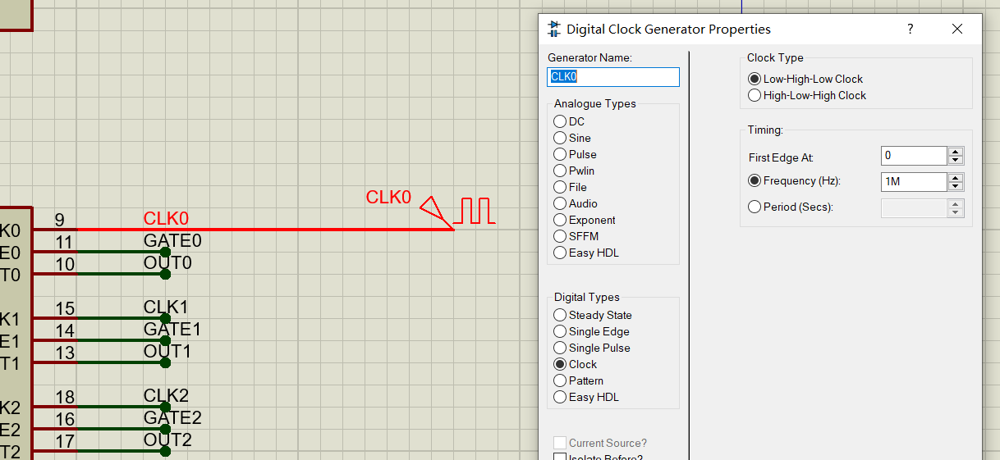

# 6-3 电子发声设计实验

> 8253 Play Music *Friendship All Long a Way* , *XiaoBaiChuan* 
>
> Source Project: https://github.com/pacria/AsmDemo/tree/homework/Proteus_work/Timer/source


### 实验内容

根据实验给出的音乐频率表和时间表，编写程序控制8254，使其输出连接到扬声器上能发出响应的乐曲。


### 实验原理

乐曲由音符组成，排布得当就可以发出动听的乐音。不同的音符有着不同的频率：频率越高，声调就越高，就越显得尖锐；频率越低，声调就越低，越显得低沉。使用8253产生单个音符，可以使其工作在方式3——方波发生器，对CLK进行分频，产生特定的频率，这里面的基本关系为：

<div align=center>计数初值=输入时钟频率➗输出时钟频率</div>


查阅资料，我们可以列出了简谱中由Do至Si各音符（低八度/中音/高八度，均为C大调）的频率以及**当输入时钟频率为1MHz**时的计数初值。

<div align=center></div>


因此我们首先建立基本的音符表，核心代码如下图所示

```assembly
CNOTE_TABLE DW 0, 3831, 3413, 3040, 2865, 2551, 2273, 2025 ; LOW -- Do Re Mi Fa So La Si (COUNT VALUE)

            DW 1911, 1703, 1517, 1432, 1276, 1136, 1012    ; MEDIUM -- Do Re Mi Fa So La Si(COUNT VALUE)

            DW 956, 851, 758, 716, 638, 568, 506           ; HIGH -- Do Re Mi Fa So La Si (COUNT VALUE)

```


一首乐曲不是简单的不同音符的拼凑，不同的音符在时间上依次发声，我们将乐谱中每一小节的音符总长度称节拍。常见的，*1/4*拍也就是*4分音符为一拍*，*每小节一拍*。仍以四分音符为例，其持续时间为1/4s，类似地，八分音符的持续时间为1/8s。所以说，利用8253发声，还要考虑音符的持续时长——由其节拍决定，在程序设计中，我们通常实现一个延时程序`DELAY`来做到这一点，通常`DELAY`程序的设计是通过内循环实现的，在Proteus工具中，我们设CPU主频为5MHz，想让单位时间为1/4s，则DELAY延时程序内部的循环次数=$$1/4
\times 5 \times 10^{6} = 1,250,000 \approx 65535 \times
19$$。为了提高它的扩展性，能够延时N个单位时间，将N送入`BX`中，然后执行过程调用，完整的子程序设计为

```assembly
DELAY PROC NEAR

    PUSH CX

HERE:
    MOV CX,0A0F0H
INNER:
	DEC CX
	JNZ INNER
	DEC BX
	JNZ HERE

    POP CX
    RET

DELAY ENDP
```

需要注意，DELAY子程序具体单步要延时多少次（或者说每次设置`CX`为多少），并不是固定的，要依据具体的仿真环境来决定。

对于具体乐曲的播放，可以建立两个表，一个用于存放音调频率为`FREQ_TABLE`，一个用于存放播放的持续时间为`TIME_TABLE`。

由于前面已经建立了基本的音符表，为了方便表示音调的顺序，例如我们要表示一个升阶的顺序（*do re mi fa so la si*)，则将`FREQ_TABLE`设置为`DB 1, 2, 3, 4, 5, 6, 7`，那么这个表对应的计数初值应该为`3831，3413， 3040， 2865， 2551， 2273， 2025`。那么该如何寻址呢？利用基址变址寻址方式，**`CNOTE_TABLE[BX]`**——其中`BX`即为当前`FREQ_TABLE`中的元素（音调值）（这么说不太准确，因为`CNOTE_TABLE`每个元素（计数初值）存储占两个字节，所以取出`FREQ_TABLE`中的元素不能直接放入`BX`中，而要首先做`×2`运算——也就是左移一位），就是当前音调对应的计数初值。

举个例子，如若FREQ_TABLE已经读到第1位元素，这是2（表示音符为*re*，且低八度），对应的计数初值可以通过**`CNOTE_TABLE[4]`**获取到（`2\*2=4`单个计数初值占两个字节）


参考实验教程中的内容，先选用《友谊地久天长》的乐谱。实验流程图可以表示为

<div align=center></div>

<div align=center>实验程序流程图</div>

在本实验中，8253的示意接法为，为了与实验一致，这里`CLK0`接频率为1MHz的晶振电路。还注意到，我们使用的是方式三，采用软件启动的方式，较为简单。所以，对于`CNT0`，它的方式控制字应为`00110110B`即`36H`。

<div align=center></div>

<div align=center>8253芯片的示意接法</div>

与[实验平台](https://github.com/pacria/AsmDemo/tree/homework/Proteus_work/Timer/source)（自建的）一致，我们让8253的片选译码端口首地址为`0A000H`，采用8086的`A1`, `A2`作片内寻址。为了控制发声信号，另在发声单元前加上一个与门，由一块8255芯片的`PC0`脚控制。下面是基本的发声单元。

<div align=center></div>

<div align=center>总硬件接线图</div>

在程序设计上，我们让发声的主要工作交由子程序`SING`完成。对于单次发声（也就是频率固定的一次发声）在调用`SING`之前，我们首先将计数初值存放在`AX`中，将相对持续时间存放在`BX`中。`SING`的执行过程为

```assembly
SING PROC NEAR

OUT DX,AL

MOV AL,AH

OUT DX,AL ;传送计数值到8253


MOV DX, MCU8255MODE

MOV AL, 00000001B

OUT DX, AL ; Set PC0=1 Open the speaker.


CALL DELAY

DEC AL

OUT DX,AL ; Close the speaker.

RET

SING ENDP
```


可以看出SING子程序首先将AX的值送往8253的`CNT0`使其开始在`OUT0`端发出方波信号，然后设置8255的`PC0`端为1，结合前面的发声单元示意图，这就可以控制扬声器进行发声了，随后进行一个延时工作，`BX`中的值将在`DELAY`子程序中被使用。最后，我们再使`PC0`端为`0`关闭扬声器，单次完整的发声就结束了。

<div align=center></div>

<div align=center> <i>友谊地久天长</i> 简谱</div>


按照*友谊地久天长*的简谱，我们可以写出对应的`FREQ_TABLE`和`TIME_TABLE`

```assembly
FREQ_TABLE DB 5, 8, 8, 8, 10, 9, 8, 9, 10, 8, 8, 10, 12, 13, 13, 13
		   DB 12, 10, 10, 8, 9, 8, 9, 10, 8, 6, 6, 5, 8, 13
		   DB 12, 10, 10, 8, 9, 8, 9, 13, 12, 10, 10, 12, 13, 15
		   DB 12, 10, 10, 8, 9, 8, 9, 10, 9, 6, 6, 5, 8, 0

TIME_TABLE DB 4, 6, 2, 4, 4, 6, 2, 4, 4, 6, 2, 4, 4, 12, 1, 3
		   DB 6, 2, 4, 4, 6, 2, 4, 4, 6, 2, 4, 4, 12, 4
		   DB 6, 2, 4, 4, 6, 2, 4, 4, 6, 2, 4, 4, 12, 4
		   DB 6, 2, 4, 4, 6, 2, 4, 4, 6, 2, 4, 4, 12
```

同样的，根据小白船的简谱，我们写出对应的`FREQ_TABLE`和`TIME_TABLE`


<div align=center></div>

<div align=center><i>小白船</i> 简谱（第一部分）</div>

对应的数据表为：

```assembly
FREQ_TABLE  DB 12, 13, 13, 12, 10, 12, 10, 9, 8, 5  ; lan lan de tian kong yin he li
            DB 6, 8, 9, 12, 10, 10                  ; you zhi xiao bai chuan
            DB 12, 13, 12, 10, 12, 10, 9, 8, 5      ; chuan shang you ke gui hua shu
            DB 6, 8, 5, 9, 8, 8                     ; bai tu zai you wan
            DB 10, 9, 10, 9, 10, 13, 12             ; jiang er jiang er kan bu jian 
            DB 10, 9, 10, 13, 12, 12                ; chuan shang ye mei fan
            DB 15, 15, 13, 12, 10, 12, 13           ; piao ya piao ya
            DB 12, 10, 8, 5, 9, 8, 8                ; piao xiang yun tian
            DB 8, 8, 8, 5, 8, 8, 8, 8, 8, 5, 8, 8
            DB 12, 13, 12, 10, 12, 10, 9, 8, 5      ; du guo na tiao yin he shui
            DB 6, 8, 9, 12, 10, 10                  ; zou xiang yun cai guo 
            DB 0, 5, 8, 10, 9, 8, 0, 5, 8, 10, 13, 12 ; wu... wu...
            DB 0, 11, 10, 9                         ; wu...
            DB 0, 5, 8, 10, 9, 8                    ; la la la
            DB 10, 10, 10, 9, 9, 10, 13, 12         ; zai na yao yuan de di fang
            DB 10, 9, 10, 13, 12, 12                ; shang zhe jin guang
            DB 12, 12, 10, 8, 6, 8, 6               ; chen xing shi deng ta
            DB 12, 10, 8, 5, 9, 8, 8, 32             ; zhao ya zhao dei liang
            
TIME_TABLE  DB 4, 1, 1, 4, 2, 2, 1, 1, 2, 6
            DB 4, 2, 4, 2, 6, 6
            DB 4, 2, 4, 2, 2, 1, 1, 2, 6
            DB 4, 2, 4, 2, 6, 6
            DB 4, 2, 4, 2, 4, 2, 6
            DB 4, 2, 4, 2, 6, 6
            DB 6, 4, 1, 1, 4, 2, 6
            DB 2, 2, 2, 4, 2, 6, 6
            DB 2, 2, 2, 2, 2, 2, 2, 2, 2, 2, 2, 2
            DB 4, 2, 4, 2, 2, 1, 1, 2, 6
            DB 4, 2, 4, 2, 6, 6
            DB 2, 2, 2, 2, 2, 2, 2, 2, 2, 2, 2, 2
            DB 2, 2, 2, 6
            DB 2, 2, 2, 2, 2, 2
            DB 4, 2, 4, 1, 1, 4, 2, 6
            DB 4, 2, 4, 2, 6, 6
            DB 6, 2, 2, 2, 4, 2, 6
            DB 2, 2, 2, 4, 2, 6, 6
```

在实践中，我们只需要给出对应曲谱的`FREQ_TABLE`和`TIME_TABLE`,其他无需做改动即可演奏该乐曲。完整的程序如下所示

```assembly
DATAS SEGMENT
CNOTE_TABLE DW 0, 3831, 3413, 3040, 2865, 2551, 2273, 2025 ; LOW    -- Do Re Mi Fa So La Si (COUNT VALUE)
			DW 1911, 1703, 1517, 1432, 1276, 1136, 1012    ; MEDIUM -- Do Re Mi Fa So La Si (COUNT VALUE)
			DW 956,  851,  758,  716,  638,  568,  506     ; HIGH   -- Do Re Mi Fa So La Si (COUNT VALUE)

FREQ_TABLE DB 5, 8, 8, 8, 10, 9, 8, 9, 10, 8, 8, 10, 12, 13, 13, 13
		   DB 12, 10, 10, 8, 9, 8, 9, 10, 8, 6, 6, 5, 8, 13
		   DB 12, 10, 10, 8, 9, 8, 9, 13, 12, 10, 10, 12, 13, 15
		   DB 12, 10, 10, 8, 9, 8, 9, 10, 9, 6, 6, 5, 8, 0
TIME_TABLE DB 4, 6, 2, 4, 4, 6, 2, 4, 4, 6, 2, 4, 4, 12, 1, 3
		   DB 6, 2, 4, 4, 6, 2, 4, 4, 6, 2, 4, 4, 12, 4
		   DB 6, 2, 4, 4, 6, 2, 4, 4, 6, 2, 4, 4, 12, 4
		   DB 6, 2, 4, 4, 6, 2, 4, 4, 6, 2, 4, 4, 12
		   
DATAS ENDS

STACKS SEGMENT STACK
   DW 32 DUP(?)
STACKS ENDS

CODE    SEGMENT PUBLIC 'CODE'
        ASSUME CS:CODE, DS:DATAS, SS:STACKS
      IOY0 EQU 8000H    ; IOY0-8255
      MCU8255A    EQU IOY0+00H     ; Output
      MCU8255B    EQU IOY0+02H     ; Input
      MCU8255C    EQU IOY0+04H     ; For more
      MCU8255MODE EQU IOY0+06H     ; Mode Control

      IOY2 EQU 0A000H   ; IOY2-8253
      MCU8253CNT0 EQU IOY2+00H     ; CNT0
      MCU8253CNT1 EQU IOY2+02H     ; CNT1
      MCU8253CNT2 EQU IOY2+04H     ; CNT2
      MCU8253MODE EQU IOY2+06H     ; Mode Control
      IOY3 EQU 0B000H   ; IOY3-8259

START:
      MOV AX, DATAS
      MOV DS, AX
INIT:
	  MOV DX, MCU8255MODE
	  MOV AL, 10000000B            ; A, B, C - Output(Method0)
	  OUT DX, AL

      MOV AL, 00000000B            ; Set PC0=0
      OUT DX, AL

      MOV DX, MCU8253MODE
      MOV AL, 00110110B            ; CNT0 - Read first low, then high. Method3, binary
      OUT DX, AL    

      CALL OPENING

MAIN:
	  LEA SI, FREQ_TABLE
	  LEA DI, TIME_TABLE
	  XOR BX, BX

PLAY:	
	  MOV DX, MCU8253CNT0
	  MOV BL, BYTE PTR[SI]
	  CMP BL, 32
	  JZ TEND

      SHL BL, 1
      MOV AX, CNOTE_TABLE[BX]
      MOV BL, BYTE PTR[DI]
      CALL SING

      INC SI
      INC DI
      JMP PLAY

OPENING PROC NEAR	  
	  MOV DX, MCU8253CNT0
      MOV AX, 3831
	  MOV BX, 1
	  CALL SING
	  
	  MOV DX, MCU8253CNT0
	  MOV AX, 2134
	  MOV BX, 2
	  CALL SING
	  
	  MOV DX, MCU8253CNT0
	  MOV AX, 2025
	  MOV BX, 1
	  CALL SING

      MOV DX, MCU8253CNT0
	  MOV AX, 3831
	  MOV BX, 3
	  CALL SING
	  
	  RET 
OPENING ENDP

SING PROC NEAR
    OUT DX,AL
	MOV AL,AH
	OUT DX,AL ;传送计数值到8253
	
	MOV DX, MCU8255MODE
	MOV AL, 00000001B
	OUT DX, AL                     ; Set PC0=1 Open the speaker.
	
	CALL DELAY
	
	DEC AL
	OUT DX,AL                      ; Close the speaker.
	RET

SING ENDP

DELAY PROC NEAR

    PUSH CX

HERE:
    MOV CX,0A0F0H
INNER:
	DEC CX
	JNZ INNER
	DEC BX
	JNZ HERE

    POP CX
    RET

DELAY ENDP

CODE    ENDS
END START
```


### 进行实验

首先在[实验平台](https://github.com/pacria/AsmDemo/tree/homework/Proteus_work/Timer/source)（自建的）上，调整硬件电路，使`CLK0`接*1MHz*的时钟信号，如下图所示

<div align=center></div>

接下来对软件进行编译工作，由于本实验工程采用firmware固件，可以直接进行编译，无需手动导入.exe文件，编译无报错信息，提示一切正常

<div align=center></div>

<div align=center> SOURCE CODE界面进行编译工作图示</div>

然后，我们点击下方的播放按钮，可以看到电路开始工作，经仿真随后由计算机声卡发出一阵悦耳的提示音后（这是因为在代码执行过程中首先调用了子程序`OPENING`——其目的是发出一段短暂的提示音），可以听到熟悉的《友谊地久天长》的乐音响起。

