# 实验名称  8-1 D/A转换实验

### 实验内容、目的与要求

（*原唐都实验教材4.10D/A转换实验*）

**实验内容**：

设计实验电路图实验线路并编写程序，实现D/A转换，输入数字量由程序给出。要求产生方波和三角波，并用示波器观察输出模拟信号的波形。

**实验目的**：

1.  学习数模转换的基本原理

2.  掌握DAC0832的使用方法

3.  实验原理与步骤

D/A转换器的作用是将数字量转换为响应的模拟量，数字量由二进制位组成，每位的权值为$$2^{i}$$，响应的模拟量输出为$$v_{o}
= k \cdot \Sigma_{i = 0}^{n - 1}D_{i} \times
2^{i}$$。$$k$$就是DAC转换过程中的比例系数。

两个相邻的数码转换出的电压值不是连续的，其差值由最低码位所代表的位权值决定——它是信息所能分辨的最小量，用`1LSB`表示。而最大输入数字量的最大电压输出值（绝对值）用`FSR`表示。可以看出，`1LSB`$$=
1 \times k$$V, `1FSR`$$= \left( 2^{i} - 1 \right) \times k$$V

DAC由数字寄存器，模拟电子开关，位权网络，运算放大器和基准电压源组成。电阻位权网络是DAC的核心部件，有权电阻网络和R-2R
T形电阻网络两种主要网络形式

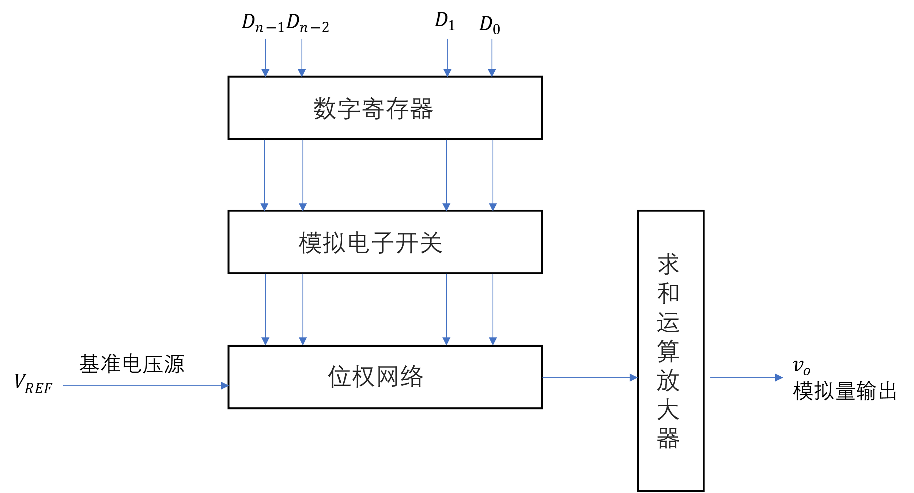


对于权电阻网络型或是倒T形D/A转换器，其转换公式均为

$$
v_{o} = - \frac{V_{\text{REF}}}{2^{n}}\overset{n - 1}{\underset{i = 0}{\Sigma}}\left( D_{i} \times 2^{i} \right)\text{ }
$$

所以，这个D/A转换器的分辨率为$$V_{\text{REF}}/2^{n}$$，1FSR=$$V_{\text{REF}}/2^{n}
\times (2^{n} -
1)$$。其他的描述性能的参量还有转换精度——包括非线性误差，温度系数误差，电源波动误差等，以及转换时间，还有动态范围——指最大和最小输出值范围，一般取决于参考电压$$V_{\text{REF}}$$的高低。

下面我们来看本实验用到的D/A转换芯片——DAC0832，数位宽度为8bit，内部包含一个倒T形网络，输出的是差动电流信号。要想得到模拟电压输出，必须外接运算放大器，通过电压并联负反馈结构。它的外部引脚和内部结构示意图如下所示

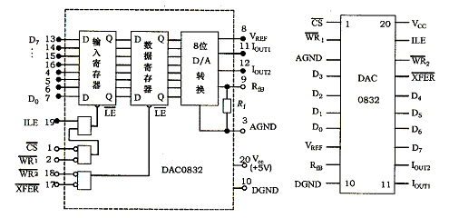

Figure DAC0832 内部结构与外部引脚

简单介绍一下其引脚，包括以下几部分：

**D0\~D7**：这是8位数据输入端

**\#CS**：片选信号，接系统译码电路，低电平有效。

**ILE**：输入寄存器选通信号，与**\#CS**， **\#WR1**一同决定将要转换的数据送入输入寄存器

**\#WR1**：输入寄存器的写入控制，低电平有效。

**\#WR2**：数据变换寄存器（DAC寄存器）写入控制，低电平有效。

**\#XFER**：传送控制信号，低电平有效。与\#WR2一同控制数据变换寄存器。

**Iout1，Iout2**：为模拟电流差动输出端，一般情况下Iout1+Iout2=常数。当DAC寄存器中的内容为FFH时，Iout1电流最大；当DAC
寄存器中内容为00H时，Iout1电流最小。

**Rfb**： 反馈电阻输出端，接运放输出

**Vref**：参考电压输入端，接入参考电压源，一般为-10V\~+10V

**Vcc**：芯片的电源电压，为+5V或+15V

**AGND**：模拟地

**DGND**：数字地

观察DAC0832的内部，发现其有两级缓冲寄存结构，第一级是8位的数据输入寄存器，由**ILE**, **#CS**, **\#WR1**共同控制，只有当**ILE**=1, **\#CS**=0, **#WR1**=0时才有**\#LE1**=0是输入寄存器可以接受数据输入；第二级是8位的DAC寄存器，由控制信号**\#WR2**和**\#XFER**共同控制，当**\#WR2**=0，**\#XFER**=0时，DAC寄存器可以将前一级的数据传入到D/A转换单元中，随之有模拟量（电流）输出。如果我们把DAC寄存器视为DAC0832内部的一个端口，那么它的片选信号就是**\#XFER**。

由此，我们可以确定0832也有三种工作模式：单缓冲工作方式，双缓冲工作方式，直通工作方式（无缓冲工作方式）。在单缓冲工作方式下，有一个寄存器（输入寄存器或DAC寄存器）工作在直通状态。比如，我们让DAC寄存器工作在直通状态，就可以接**\#WR2**和**\#XFER**到数字地，**ILE**接高电平（+5V），\#CS接端口地址译码器输出，**\#WR1**接**\#IOW**信号。当CPU向其端口地址发写命令时，数据被写入输入寄存器，可以随即进行数模转换。这种工作模式适用于只有单路输出或虽有多路输出但不要求同时刷新模拟输出的场景。

双缓冲工作模式下，CPU要对0832执行两步写操作：首先将数据写入输入寄存器，然后将输入寄存器的内容写入DAC寄存器。具体过程是，当**ILE**=1时，**\#CS**=**\#WR1**=0时，待转换数据被写入输入寄存器；随后当**\#XFER**=**\#WR2**=0的时候，数据才被写入DAC寄存器，并同时启动数模转换。连接方式是：**ILE**固定接高电平（+5V），**\#WR1**，**\#WR2**均接**\#IOW**，而**\#CS**和**\#XFER**分别接两个端口的地址译码线（这样一片0832就占用了两个端口地址）。

这种工作模式的优点是数据接收和启动转换的过程可以异步进行，提高了数模转换的效率，同时还可用于多个通道同时进行D/A转换的场景。

在直通工作模式下，模拟输出端始终跟踪输入端**D0\~D7**的变化，在实际工程实践中，直通方式很少启用。

对于产生方波的实验要求，由于只有单片0832，所以可以工作在单缓冲工作方式下，使其一段时间内输出为0V，接下来的一段时间内输出为较高的电压。这对应于输入的数字量应当是在`00H`和`FFH`之间跳变，为了观察上的明显，还要有一定的延时处理，表现为模拟量输出即为方波。这个过程可以用下面的程序框图表示

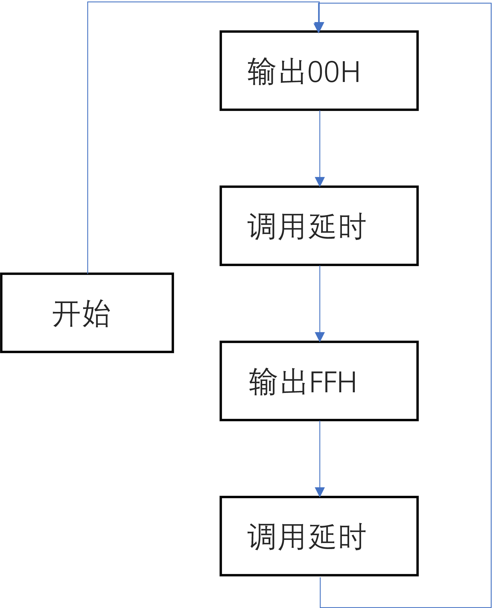

Figure 产生方波的程序流程图

参考实验教程书的内容，由于0832输出的是差动电流，需要经运放转为模拟电压，D/A实验单元电路图如下

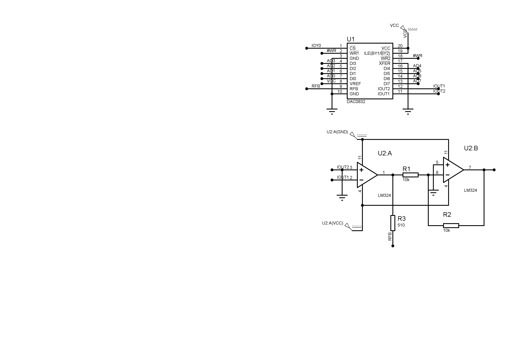

Figure DAC实验单元（LM324外部供电VCC=12V, VEE=-12V）

给出汇编的代码为（在代码中我们设置DA0832的译码地址为`E000H`，DELAY子程序内部的循环次数为`0FH`$$\times
$$`0FH`=`256`，不同于实验书上的设计，这是出于实际仿真上的效果的考量，具体的这部分内容不必受限制）

```assembly
DA0832 EQU 0E000H

STACKS SEGMENT STACK
DW 256 DUP(0)
STACKS ENDS

DATAS SEGMENT

DATAS ENDS

CODES SEGMENT
ASSUME CS:CODES, DS:DATAS, SS:STACKS

START:
MOV AX, DATAS
MOV DS, AX


INNERLOOP:
MOV DX, DA0832
MOV AL, 00H
OUT DX, AL

CALL DELAY
MOV DX, DA0832
MOV AL, 0FFH
OUT DX, AL

CALL DELAY

JMP INNERLOOP

DELAY PROC NEAR
PUSH CX
PUSH AX
MOV CX, 000FH

D2:
MOV AL, 0FH

D1:
DEC AL
JNZ D1

LOOP D2

POP AX
POP CX

RET
DELAY ENDP
CODES ENDS
END START

```

对于三角波的形成，可以依照下面的思路

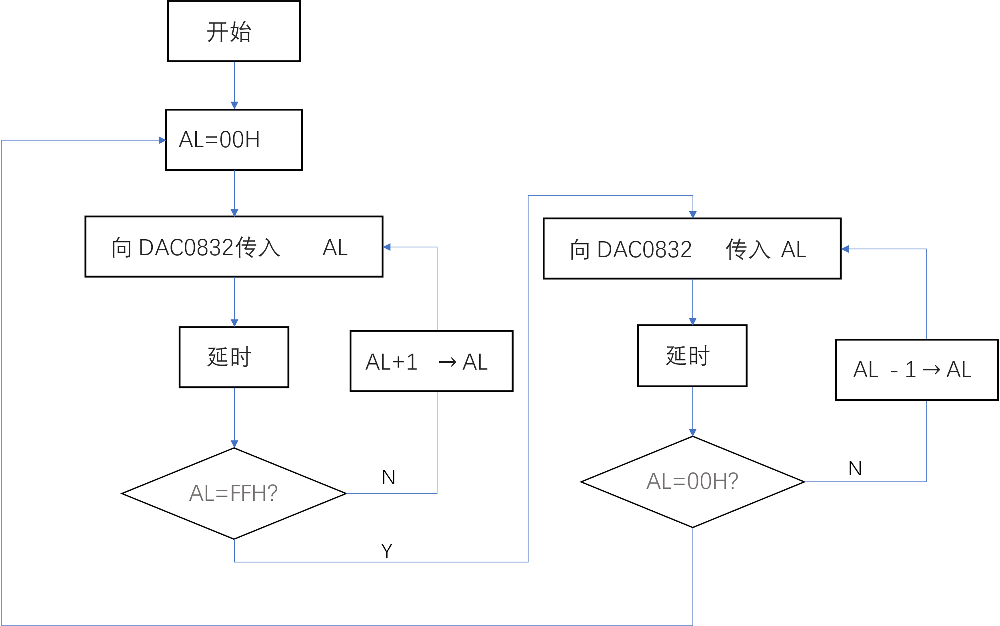

Figure 三角波发生程序流程图

让输出的数字量先由`00H`增加到`FFH`，再由`FFH`减至`00H`，完成一个循环，对于输出的模拟量成线性变化经历了一个先增后减的过程，表现为三角波（也称正向锯齿波），代码如下

```assembly
DA0832 EQU 0E000H

STACKS SEGMENT STACK
DW 256 DUP(0)
STACKS ENDS

DATAS SEGMENT

DATAS ENDS

CODES SEGMENT
ASSUME CS:CODES, DS:DATAS, SS:STACKS

START:
MOV AX, DATAS
MOV DS, AX

MOV DX, DA0832

PERIOD:
MOV AL, 00H
INCLOOP:
OUT DX, AL

CALL DELAY
INC AL
CMP AL, 0FFH
JNZ INCLOOP

DECLOOP:
OUT DX, AL

CALL DELAY
DEC AL
JNZ DECLOOP

JMP PERIOD

DELAY PROC NEAR
PUSH CX
PUSH AX
MOV CX, 0002H    ; 1388H = 5000

D2:
MOV AL, 64H      ; 64H = 100


D1:
DEC AL
JNZ D1

LOOP D2

POP AX
POP CX

RET
DELAY ENDP
CODES ENDS
END START


```

### 实验数据记录及实验结果


依照电路图完成硬件的搭接后，将产生方波的程序编译后生成`.EXE`文件，送入8086处理器的程序选择栏中。

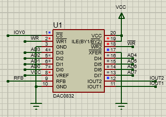

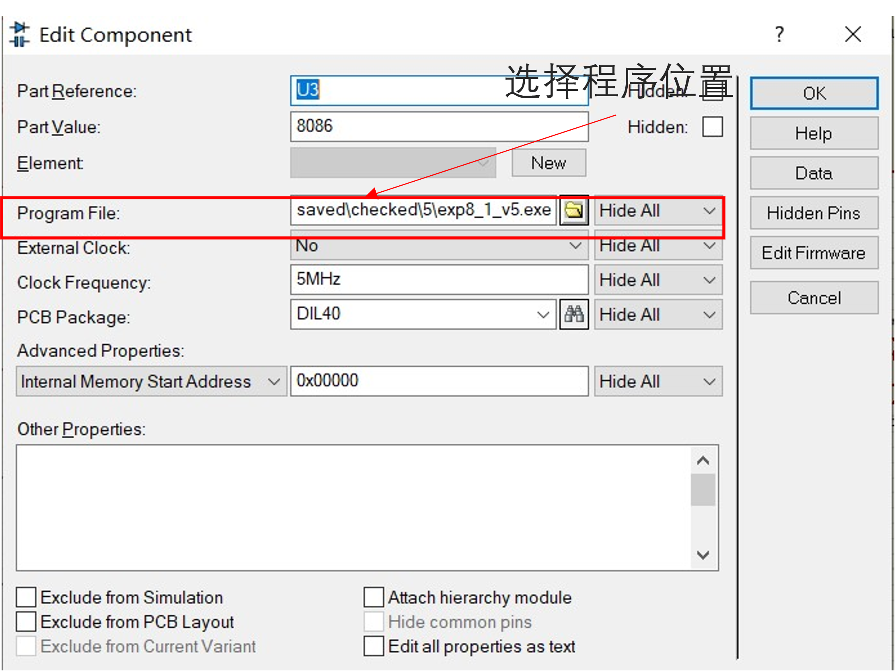

Figure 左图：实验过程中DAC0832的某时刻 右图：设置8086的执行文件

选择Proteus仪器面板中的示波器工具，将输出电压接到示波器的B端口，启动仿真，会发现自动弹出一个示波器窗口，在未调整示波器格子的分度值时，观察结果如下图所示，输出的波形很密。为使其更便于观察可以按图中说明操作。

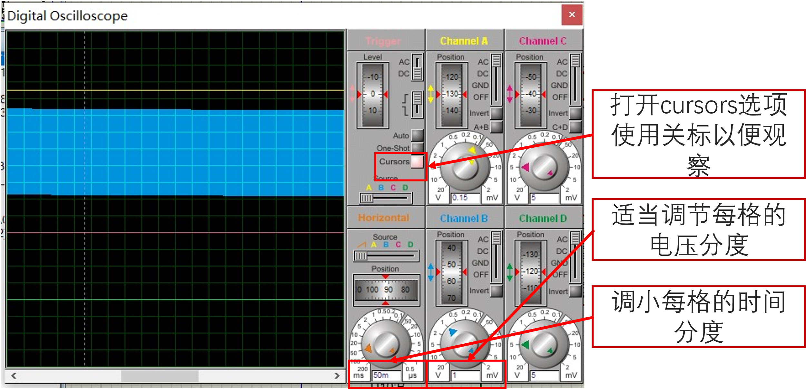

Figure 方波产生实验中示波器初始波形

经调整，示波器展示了输出的方波波形结果，由光标指示的数据，可以观察出总的输出Vpp(峰-峰值)$$\approx$$5V，方波周期T$$\approx$$2$$\times$$(2.65
-
1.75)$$\approx$$1.8ms，频率约为555.56Hz，由于8086的主频为5MHz，可以推出分频比为$$5,000,000
\div 555.56
\approx$$9000，由于Proteus提醒我们此仿真未工作在实时模式下，与前面的256$$\times$$2周期延时有一定区别也是可以接受的。

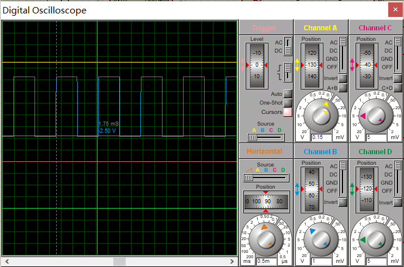


Figure 调整后的示波器波形图


Figure Proteus提供的Warning信息

我们进一步修改汇编代码，增加延时到一个很大的程度，再观察这里的波形，发现方波特性变差了，波形结果如下图所示（A通道同样接了输出电压信号），可能是由于DAC转换器内部寄存器在较大延时内有一定衰减造成的。

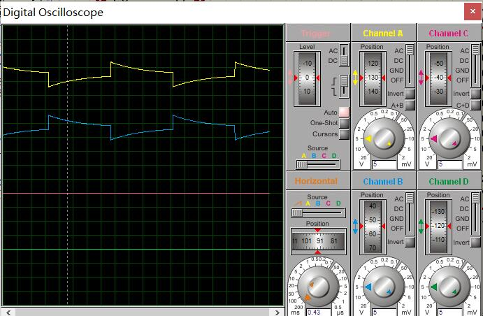

Figure 延长延时（较极端情况）后的方波效果

下面我们来观看三角波波形，编译相应程序给往8086（硬件不需要作更改），得到波形如下图所示

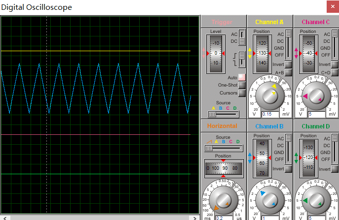

Figure 三角波实验波形

出现了明显的三角波波形，在这里，AL是由`00H`变为`FFH`再变为`00H`完成一个循环，如果我们改变AL的最大输出值，则可以完成对三角波幅值的调节，在每小级的改变中，有较短的延时程序，如果我们改变延时的大小，则可以完成对三角波周期（频率）的调节。

注意到这里的三角波并不是平滑的，而是有一个个的“小台阶”，这是由DAC转换器的原理造成的，调小每格的时间分度和电压分度，并选择示波器上的*One-shot*观察一个“快照”，可以注意到

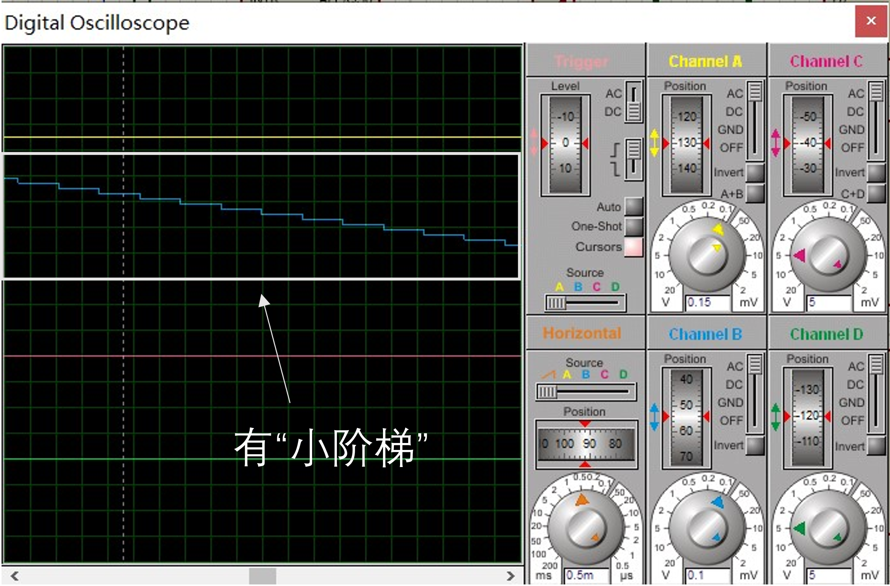

Figure 调整时间，电压分度后的三角波实验波形

在实际的工业控制中，为了使输出的模拟量平滑，可以通过（低通）滤波电路实现更“光滑”的输出。